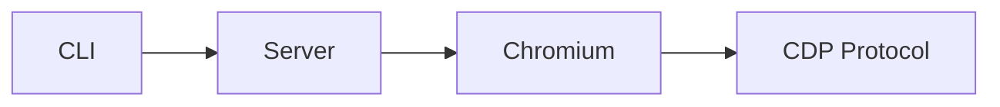

# 《AI 工程流水线：gstack 源码深度解读》写作规范

## 基本信息

| 属性 | 值 |
|------|-----|
| 书名 | 《AI 工程流水线：gstack 源码深度解读》 |
| 目标读者 | 3年以上经验的后端工程师、对 AI 辅助编程感兴趣的技术管理者 |
| 源码项目 | gstack (garrytan/gstack) |
| 编程语言 | TypeScript / Bash / Go |
| 预计章节数 | 10 |
| 每章字数 | 4000~6000字 |
| 项目仓库 | https://github.com/garrytan/gstack |

## 文风定义

- **人称**: 第一人称复数（"我们"）
- **语气**: 通俗实用、技术精准、略带热情
- **比喻密度**: 每个核心概念至少一个比喻
- **幽默程度**: 偶尔（不超过每章2处）
- **读者称呼**: "你"或"各位开发者"

### 风格示例

> 想象你正在指挥一个乐队。每个乐手（AI Agent）都有自己的座位和乐器（技能），而你——不需要亲自演奏——只需要在关键节点给出节拍。当代码需要审查时，review 技能自动上场；当需要发布时，ship 技能接手。这就是 gstack 的精髓：**你不是乐手，你是指挥家**。

### 禁止的表达方式

- ❌ "显而易见" — 读者可能觉得不显然
- ❌ "非常简单" — 往往跟着一段复杂解释
- ❌ "只需...就行了" — 从不"只需"
- ❌ "正如我们所见" — 没有人和你"一起见"
- ❌ 使用过多被动语态 — 保持主动和直接

## 格式规范

### 标题层级

| 层级 | 用途 | 数量限制 | 示例 |
|------|------|----------|------|
| H1 (`#`) | 章标题 | 每章仅一个 | `# 第3章：持久化浏览器` |
| H2 (`##`) | 主要节 | 3~6个/章 | `## 为什么需要持久化？` |
| H3 (`###`) | 子节 | 按需 | `### Cookie 安全机制` |
| H4 (`####`) | 避免使用 | 超过3个则考虑拆分 | — |

### 代码块规范

- **必须标注语言**: ` ```typescript ` 或 ` ```bash `
- **关键行添加注释**: 解释"为什么"而不是"是什么"
- **单个代码块不超过25行**
- **超长代码使用省略**: `// ...省略{{功能描述}}相关代码...`
- **文件路径标注**: 代码块上方标注源文件路径

```typescript
// browse/src/server.ts (第1-15行)
import type { Server } from 'bun';

const server: Server = Bun.serve({
  port: randomPort(),  // 随机端口避免冲突
  fetch(req, server) {
    return handleRequest(req);  // 委托给处理器
  },
});
```

### 表格使用

- 每章至少包含1个表格（对比、总结、流程）
- 复杂表格需要简短标题说明

### 图形描述

当需要图形时，使用 ASCII 图或 Mermaid 语法：



## 内容组织

### 每章结构

```
# 第X章：标题

## 概述（100字内）
本章探讨什么，读者将学到什么。

## 核心概念（500-800字）
技术原理和设计思想，配合比喻。

## 源码解析（1500-2000字）
关键代码段，每段不超过25行。

## 实践应用（500-800字）
如何使用、调试、扩展。

## 本章小结（100字内）
3-5个要点总结。
```

### 引用规范

- 源码文件: `{{文件名}}`（加粗）
- 函数名: `functionName()`（等宽）
- 命令行: `command`（等宽，带 $ 前缀示例）
- 章节引用: "参见第X章"或"（见 chX）"

## 技术准确性要求

- 所有代码示例必须与源码一致（版本：当前 main 分支）
- API 调用检查实际参数名
- 路径使用相对路径（如 `browse/src/server.ts`）
- 错误处理逻辑必须完整描述

## 常见模式

### 解释架构决策

> **为什么这样做？**
>
> [简短回答]
>
> 如果不这样做会怎样：[反面案例]

### 描述数据流

> 数据从 A 到 B 的旅程：
> 1. 步骤一：...
> 2. 步骤二：...
> 3. 步骤三：...

### 解释安全设计

> **安全检查点**：[机制名称]
>
> - 输入验证：...
> - 权限控制：...
> - 审计日志：...

