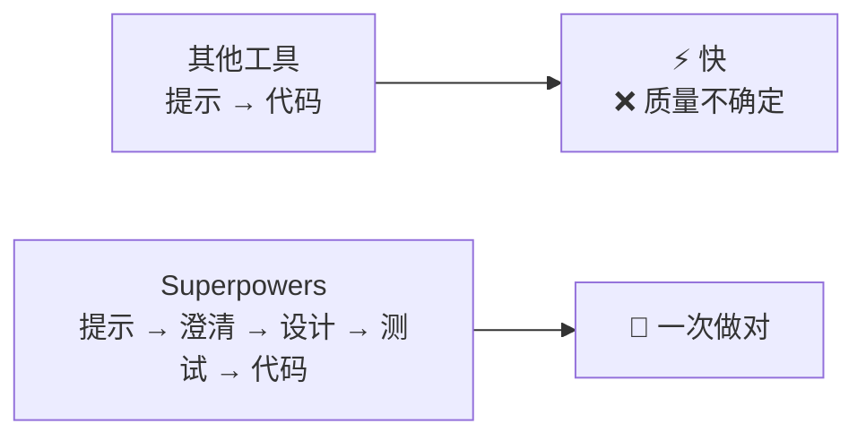

# 第1章：Superpowers 概述与快速上手

> 你有没有过这样的经历：让 AI 帮你写代码，它哗哗地输出一大堆，看起来很专业，但一跑起来——编译错误、逻辑错误、边界情况全没考虑。你花了半小时改 AI 写的代码，比自己写还累。
>
> 或者另一个场景：你让 AI 帮你开发一个功能，它上来就开始写代码，写了三百行之后你发现——它理解错了需求。你不得不从头来。
>
> Superpowers 就是来解决这些问题的。它不是让 AI 更快地写代码，而是让 AI 学会"先想清楚再动手"。

## 1.1 Superpowers 是什么

**Superpowers** 是一个为 AI 编程助手提供"超能力"的插件框架。安装之后，你的 AI 助手会从"只会写代码"进化为"能够进行系统化设计、规范开发、持续迭代"的超级开发者。

### 核心设计理念

想象一下 RPG 游戏中的装备系统：穿上不同的装备，你的角色就获得了不同的能力。Superpowers 就是这样一个"装备系统"——每个 **Skill（技能）** 是一种可以独立使用、也可以组合的功能块。

当你需要设计一个功能时，"brainstorming" 技能自动激活，帮助你明确需求；当你需要实现时，"TDD" 技能自动激活，确保你先写测试再写代码；当你遇到 bug 时，"systematic-debugging" 技能自动激活，引导你系统化地定位问题。

### 与其他工具的区别

大多数 AI 编程助手追求的是"秒级生成代码"——你给一个提示，它给你一堆代码。这种方式的代价是：代码质量参差不齐，边界情况被忽略，架构设计全靠运气。

Superpowers 的追求是"一次做对"——通过结构化的工作流程，确保 AI 在动手之前先理解需求，先做设计，先写测试。这听起来慢，但实际上：
- 减少了返工（因为需求已经澄清）
- 减少了 bug（因为有测试保护）
- 减少了上下文切换（因为有明确的计划）



## 1.2 工作原理概览

Superpowers 的核心是 **Skills 系统**和 **Hooks 机制**。

### Skills 系统

**Skill** 是一种特殊的 Markdown 文件，定义了某种工作方式的最佳实践。每个 Skill 包含：
- 触发条件（什么时候应该用这个技能）
- 工作流程（如何执行这个技能）
- 质量标准（什么算做好了）

Skills 会自动触发——不需要你手动调用。当 AI 检测到某个 Skill 适用时，它会自动加载并遵循这个 Skill 的指导。

### Hooks 机制

**Hook** 是在特定事件发生时自动执行的脚本。Superpowers 在会话启动时（SessionStart）注入上下文，告诉 AI"你有了超能力"。

这就像给 AI 递一张便签条：`"记住，你有了 Superpowers。如果用户想开发功能，先用 brainstorming；如果用户想实现功能，先用 TDD。"`

### 多平台支持

Superpowers 支持主流的 AI 编程助手：

| 平台 | 安装方式 |
|------|----------|
| Claude Code | 官方插件市场 |
| Cursor | 官方插件市场 |
| Codex | 手动配置 symlink |
| OpenCode | JSON 配置 |
| GitHub Copilot CLI | marketplace 命令 |
| Gemini CLI | extensions 命令 |

## 1.3 安装与配置

### Claude Code（官方市场）

最简单的方式是通过官方插件市场安装：

```bash
/plugin install superpowers@claude-plugins-official
```

### Claude Code（社区市场）

如果官方市场没有，你也可以用社区市场：

```bash
/plugin marketplace add obra/superpowers-marketplace
/plugin install superpowers@superpowers-marketplace
```

### Cursor

在 Cursor Agent 聊天中安装：

```text
/add-plugin superpowers
```

或者在插件市场中搜索"superpowers"。

### Codex

告诉 Codex：

```
Fetch and follow instructions from https://raw.githubusercontent.com/obra/superpowers/refs/heads/main/.codex/INSTALL.md
```

或者手动安装：

```bash
# 1. 克隆仓库
git clone https://github.com/obra/superpowers.git ~/.codex/superpowers

# 2. 创建 symlink
mkdir -p ~/.agents/skills
ln -s ~/.codex/superpowers/skills ~/.agents/skills/superpowers

# 3. 重启 Codex
```

### OpenCode

在 `opencode.json` 中添加插件：

```json
{
  "plugin": ["superpowers@git+https://github.com/obra/superpowers.git"]
}
```

### GitHub Copilot CLI

```bash
copilot plugin marketplace add obra/superpowers-marketplace
copilot plugin install superpowers@superpowers-marketplace
```

### Gemini CLI

```bash
gemini extensions install https://github.com/obra/superpowers
```

## 1.4 核心工作流程

Superpowers 定义了一个完整的软件开发工作流程：

### 第一步：Brainstorming

当你想要开发一个功能时，"brainstorming" 技能激活。AI 不会直接写代码，而是先和你对话，了解你的真实需求：

- 你想解决什么问题？
- 有哪些约束条件？
- 成功的标准是什么？

然后 AI 会提出 2-3 个方案，分析每个方案的利弊，并给出推荐。设计会以分段的方式呈现，确保你能跟上 AI 的思路。

### 第二步：Git Worktrees

设计确认后，"using-git-worktrees" 技能激活。它会：
- 创建新的 Git 分支
- 建立隔离的工作空间
- 验证干净的测试基线

### 第三步：Writing Plans

"writing-plans" 技能激活，把工作分解成小任务。每个任务：
- 耗时 2-5 分钟
- 有明确的文件路径
- 有完整的代码
- 有验证步骤

### 第四步：执行计划

有两种执行方式：
- **subagent-driven-development**：每个任务分配给一个子代理，有两阶段审查
- **executing-plans**：批量执行，定期有人类检查点

### 第五步：TDD

在实现过程中，"test-driven-development" 技能强制执行红-绿-重构循环：
1. 写一个失败的测试
2. 看它失败
3. 写最少的代码让它通过
4. 重构
5. 如果有代码在测试之前写——删除它

### 第六步：Code Review

"requesting-code-review" 技能在任务之间激活。AI 会：
- 对照计划检查
- 按严重程度报告问题
- 关键问题会阻止继续

### 第七步：完成分支

"finishing-a-development-branch" 技能在工作完成时激活：
- 验证测试通过
- 提供选项：合并/PR/保留/丢弃
- 清理工作空间

## 1.5 Skills 技能库

Superpowers 包含多个预置技能：

### Testing（测试）

- **test-driven-development**：红-绿-重构循环（含测试反模式参考）

### Debugging（调试）

- **systematic-debugging**：4 阶段根因定位过程
- **verification-before-completion**：确保问题真的修复了

### Collaboration（协作）

- **brainstorming**：苏格拉底式设计精炼
- **writing-plans**：详细的实现计划
- **executing-plans**：带检查点的批量执行
- **dispatching-parallel-agents**：并发子代理工作流
- **requesting-code-review**：审查前检查清单
- **receiving-code-review**：响应反馈
- **using-git-worktrees**：并行开发分支
- **finishing-a-development-branch**：合并/PR 决策工作流
- **subagent-driven-development**：带两阶段审查的快速迭代

### Meta（元技能）

- **writing-skills**：创建新技能的完整指南
- **using-superpowers**：Skills 系统介绍

## 1.6 哲学原则

Superpowers 遵循几个核心原则：

### Test-Driven Development

测试先行。不要写完代码再补测试，而是在写代码之前就明确"什么是对的"。

### Systematic over ad-hoc

系统化优于随机尝试。遇到问题时，用结构化的方法定位根因，而不是这里试试那里改改。

### Complexity reduction

降低复杂度。优先选择简单的方案，除非有充分的理由选择复杂的。

### Evidence over claims

证据优于声明。不要说"这个修复有效"，而是要证明它有效。

## 1.7 快速体验

安装完成后，开启一个新会话，问你的 AI 助手：

```
Tell me about your superpowers
```

或者尝试触发 brainstorming：

```
帮我计划一下这个功能：用户可以上传头像图片
```

你应该能看到 brainstorming 技能被激活，AI 开始和你对话而不是直接写代码。

## 1.8 常见问题

### Q: Superpowers 会改变 AI 的行为吗？

是的。Superpowers 的目的是改变 AI 的工作方式——从"直接写代码"变成"先理解需求，再设计，再实现"。这是一个结构性的改变，不是简单的提示词增强。

### Q: 我必须用所有的 Skills 吗？

不是。你可以根据需要选择使用哪些 Skills。但请注意：Skills 是自动触发的，如果你让 AI 开发功能，brainstorming 技能会激活。你可以跳过设计阶段，但 AI 会明确告诉你这违反了 Superpowers 的工作流。

### Q: 如果我不喜欢某个 Skill 的建议怎么办？

你可以随时覆盖 Skill 的建议。Superpowers 的 Skills 是指导，不是强制。但如果你跳过 Skill 的建议，确保你有充分的理由。

### Q: Superpowers 适合什么规模的团队？

Superpowers 的设计适合个人开发者和小型团队。对于大型团队，可能需要额外的协作流程和约定。

## 本章小结

本章我们了解了 Superpowers 的基本概念：

- **Superpowers** 是一个为 AI 编程助手提供结构化工作流的插件框架
- 核心是 **Skills 系统**（定义工作方式）和 **Hooks 机制**（触发 Skills）
- 支持 **6 个主流平台**：Claude Code、Cursor、Codex、OpenCode、Copilot CLI、Gemini CLI
- 工作流程从 **brainstorming** 开始，经过 **planning**、**TDD**、**code review**，到 **finishing**
- 遵循 **TDD**、**系统化**、**简化**、**证据** 的原则

下一章我们将深入探讨 Superpowers 的系统架构，理解它是如何工作的。

---

**延伸阅读**：

- [Superpowers for Claude Code](https://blog.fsck.com/2025/10/09/superpowers/)
- GitHub Issues: https://github.com/obra/superpowers/issues
- Discord 社区: https://discord.gg/Jd8Vphy9jq

<!-- DRAFT_COMPLETE -->
