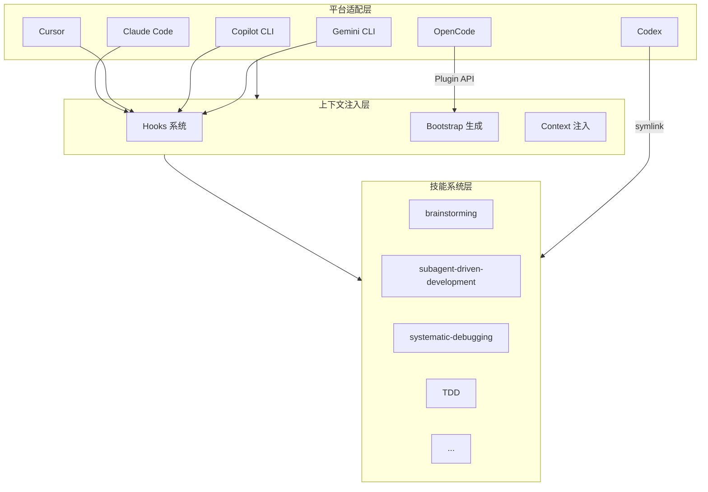
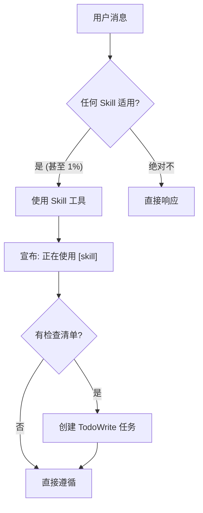

# 第2章：系统架构设计

> 在开始使用 Superpowers 之前，理解它的架构会帮助你更好地使用它，更重要的是——当你需要调试或扩展它时，你不会两眼一抹黑。
>
> 本章我们会拆解 Superpowers 的三层架构：平台适配层、上下文注入层、技能系统层。

## 2.1 整体架构概览

Superpowers 采用三层架构设计：



**平台适配层**负责处理不同 AI 平台的差异。每个平台的 Hook 配置、插件 API、命令格式都不同，这一层负责统一适配。

**上下文注入层**负责生成和注入 Bootstrap 上下文。当会话启动时，这一层读取 Skills 的内容，生成包含引导信息的上下文，并注入到 AI 的输入中。

**技能系统层**是实际的工作流程定义。每个 Skill 是一份 Markdown 文档，描述了特定工作方式的最佳实践。

## 2.2 平台适配层详解

### 为什么需要平台适配？

AI 编程助手生态是碎片化的：
- Claude Code 有自己的插件系统和 Hook 配置
- Cursor 有不同的配置格式
- Codex 使用 symlink 机制
- OpenCode 使用 Plugin API
- Copilot CLI 和 Gemini CLI 又是另一种机制

Superpowers 试图在所有这些平台上提供一致的用户体验。

### 各平台的适配方式

| 平台 | 适配方式 | 配置文件 |
|------|----------|----------|
| Claude Code | Hooks 系统 | `hooks.json` |
| Cursor | Hooks 系统 | `hooks-cursor.json` |
| Codex | 文件系统 symlink | `~/.agents/skills/superpowers` |
| OpenCode | Plugin API | `superpowers.js` |
| Copilot CLI | Hooks 系统 | `hooks.json` |
| Gemini CLI | Hooks 系统 | `hooks.json` |

### Hook 配置的差异

Claude Code 的 Hook 配置：
```json
{
  "hooks": {
    "SessionStart": [
      {
        "matcher": "startup|clear|compact",
        "hooks": [
          {
            "type": "command",
            "command": "\"${CLAUDE_PLUGIN_ROOT}/hooks/run-hook.cmd\" session-start",
            "async": false
          }
        ]
      }
    ]
  }
}
```

Cursor 的 Hook 配置：
```json
{
  "version": 1,
  "hooks": {
    "sessionStart": [
      {
        "command": "./hooks/session-start"
      }
    ]
  }
}
```

注意差异：
- 事件名称：`SessionStart` vs `sessionStart`（大小写不同）
- 配置结构：嵌套 vs 扁平
- 执行方式：`run-hook.cmd` vs 直接脚本

Superpowers 通过环境变量检测当前平台，输出不同格式的 JSON。

## 2.3 上下文注入层详解

### Bootstrap 是什么？

Bootstrap 是注入到 AI 会话开头的上下文信息。它告诉 AI：
1. 你有了 Superpowers
2. 如何找到和使用 Skills
3. Superpowers 的核心规则

Bootstrap 被包装在 `<EXTREMELY_IMPORTANT>` 标签中，吸引 AI 的注意力。

### OpenCode 的注入机制

OpenCode 使用 Plugin API，Superpowers 插件注册两个 hook：

```javascript
export const SuperpowersPlugin = async ({ client, directory }) => {
  return {
    // 1. 注册 Skills 目录
    config: async (config) => {
      config.skills.paths.push(superpowersSkillsDir);
    },

    // 2. 注入 Bootstrap 上下文
    'experimental.chat.messages.transform': async (_input, output) => {
      const bootstrap = getBootstrapContent();
      // 找到第一个用户消息，注入 Bootstrap
    }
  };
};
```

### 为什么注入到用户消息而非系统消息？

这是一个经过深思熟虑的决策。最初，Superpowers 将 Bootstrap 注入到系统消息中，但遇到了两个问题：

**问题 #750**：系统消息会在每次请求中重复，导致 Token 膨胀。对于长的对话，这会显著增加 Token 消耗。

**问题 #894**：某些模型（如 Qwen）在收到多个系统消息时会出错。Superpowers 使用系统消息注入 Bootstrap，但某些平台也使用系统消息，导致冲突。

解决方案：改为在用户消息中注入 Bootstrap。这样：
- Bootstrap 不会重复（用户消息只出现一次）
- 不会与其他平台生成的系统消息冲突

### 一次性注入机制

为了避免重复注入，Superpowers 在 Bootstrap 中添加了 `EXTREMELY_IMPORTANT` 标记：

```javascript
if (firstUser.parts.some(p =>
  p.type === 'text' && p.text.includes('EXTREMELY_IMPORTANT')
)) return; // 已经注入过，跳过
```

这是一个幂等设计：无论运行多少次，结果都一样。

### Bash Hook 的 JSON 转义

对于 Claude Code、Cursor 等平台，Hook 是用 Bash 脚本编写的。生成 JSON 输出时需要转义特殊字符：

```bash
escape_for_json() {
    local s="$1"
    s="${s//\\/\\\\}"    # 反斜杠 → 双反斜杠
    s="${s//\"/\\\"}"    # 引号 → 反斜杠引号
    s="${s//$'\\n'/\\n}" # 换行 → \n
    s="${s//$'\\r'/\\r}" # 回车 → \r
    s="${s//$'\\t'/\\t}" # 制表符 → \t
    printf '%s' "$s"
}
```

这个实现使用 bash 参数扩展（`${s//old/new}`），单次 C 级别 pass，比字符循环快几个数量级。展示了作者对 bash 性能的深刻理解。

### 跨平台 JSON 格式

根据环境变量，Hook 输出不同格式的 JSON：

```bash
if [ -n "${CURSOR_PLUGIN_ROOT:-}" ]; then
  # Cursor 格式
  printf '{"additional_context": "%s"}\n' "$session_context"
elif [ -n "${CLAUDE_PLUGIN_ROOT:-}" ] && [ -z "${COPILOT_CLI:-}" ]; then
  # Claude Code 格式
  printf '{"hookSpecificOutput": {"hookEventName": "SessionStart", "additionalContext": "%s"}}\n' "$session_context"
else
  # SDK 标准格式 (Copilot CLI 等)
  printf '{"additionalContext": "%s"}\n' "$session_context"
fi
```

## 2.4 技能系统层详解

### Skill 的结构

每个 Skill 是一个 Markdown 文件，通常包含：

```markdown
---
name: skill-name
description: Use when [触发条件]
---

# Skill Name

## Overview
核心原则 1-2 句话

## When to Use
[症状和使用场景]

## Core Pattern
Before/after 代码对比

## Quick Reference
快速查阅表格

## Implementation
代码示例

## Common Mistakes
常见错误
```

### Frontmatter 的解析

为了保持零依赖，Superpowers 手写了 Frontmatter 解析器：

```javascript
const extractAndStripFrontmatter = (content) => {
  const match = content.match(/^---\n([\s\S]*?)\n---\n([\s\S]*)$/);
  if (!match) return { frontmatter: {}, content };

  const frontmatterStr = match[1];
  const body = match[2];
  const frontmatter = {};

  for (const line of frontmatterStr.split('\n')) {
    const colonIdx = line.indexOf(':');
    if (colonIdx > 0) {
      const key = line.slice(0, colonIdx).trim();
      const value = line.slice(colonIdx + 1).trim().replace(/^["']|["']$/g, '');
      frontmatter[key] = value;
    }
  }

  return { frontmatter, content: body };
};
```

这个解析器：
- 提取 YAML frontmatter
- 去除引号
- 返回解析后的 frontmatter 和正文内容

### Skill 的自动触发

Skills 是通过 AI 的自我检查来触发的。using-superpowers Skill 定义了触发流程：



### 1% 规则

触发规则是激进的：只要有 1% 的可能性 Skill 适用，就必须调用 Skill 检查。

这防止了 AI 合理化跳过 Skill。常见合理化包括：

| AI 的想法 | 真相 |
|-----------|------|
| "这只是简单问题" | 问题也是任务，需要检查 |
| "我需要先了解更多" | 先检查再收集信息 |
| "让我先探索代码库" | Skill 告诉你如何探索 |
| "这个不需要 Skill" | Skill 存在就要用 |
| "我记得这个 Skill" | Skill 在演进，要用当前版本 |

## 2.5 零依赖设计

Superpowers 的一个显著特点是**零第三方依赖**。这是设计决策，不是技术限制。

### 为什么选择零依赖？

1. **避免依赖地狱** - 没有 package.json，没有版本冲突，没有静默的 breaking change
2. **安装简单** - 只需要复制文件
3. **可预测性** - 不会因为某个依赖的 bug 导致系统崩溃
4. **透明性** - 所有代码都是你可见的，没有隐藏的黑盒

### 代价

零依赖意味着需要手写很多基础设施代码：
- Frontmatter 解析器
- JSON 转义
- 路径规范化
- 环境检测

这些代码本可以用库来替代，但最终的结果是系统更加可控。

## 2.6 关键文件一览

| 文件 | 职责 |
|------|------|
| `superpowers.js` | OpenCode 插件主文件 |
| `hooks/session-start` | Bash Hook 脚本 |
| `hooks/hooks.json` | Claude Code Hook 配置 |
| `hooks/hooks-cursor.json` | Cursor Hook 配置 |
| `skills/using-superpowers/SKILL.md` | Bootstrap 内容来源 |
| `skills/*/SKILL.md` | 各技能的文档 |

## 2.7 扩展 Superpowers

理解了架构之后，你可以扩展 Superpowers：

### 创建新 Skill

1. 在 `skills/` 下创建目录
2. 编写 `SKILL.md`
3. 使用 writing-skills Skill 的方法测试
4. PR 到官方仓库（或本地使用）

### 添加新平台支持

1. 创建该平台的 Hook 配置
2. 在 `session-start` 中添加平台检测
3. 测试上下文注入

### 修改 Bootstrap 内容

编辑 `skills/using-superpowers/SKILL.md`，Bootstrap 会自动使用新内容。

## 本章小结

本章深入探讨了 Superpowers 的三层架构：

- **平台适配层**：处理 6 个主流 AI 平台的差异
- **上下文注入层**：生成和注入 Bootstrap 上下文
- **技能系统层**：定义 Skills 的结构和触发机制

关键设计决策包括：
- 注入到用户消息而非系统消息（避免 Token 膨胀和冲突）
- 零依赖设计（提高可控性）
- 一次性注入（幂等性）
- 跨平台 JSON 格式（兼容性）

下一章我们将深入了解 Skills 系统的实现细节，学习如何编写高质量的 Skills。

---

**延伸阅读**：

- [Issue #750: 系统消息 Token 膨胀](https://github.com/obra/superpowers/issues/750)
- [Issue #894: 多系统消息冲突](https://github.com/obra/superpowers/issues/894)
- [agentskills.io 规范](https://agentskills.io/specification)

<!-- DRAFT_COMPLETE -->
