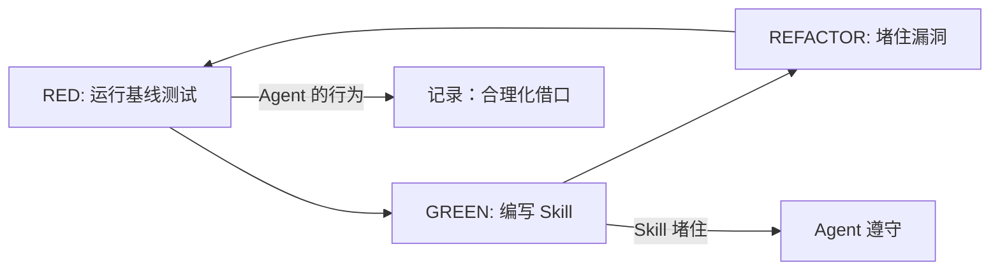
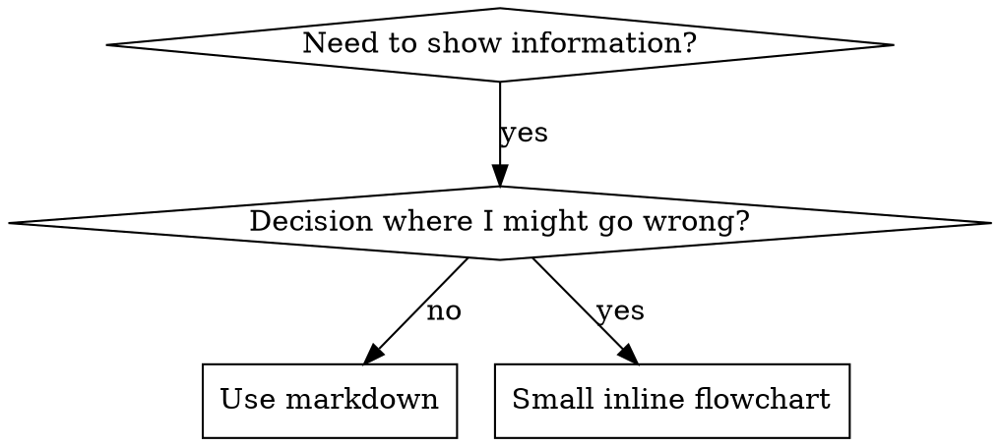

# 第3章：Skills 系统实现

> 如果说 Superpowers 是一座工厂，那么 Skills 就是工厂里的操作手册。它们不是普通文档，而是"行为代码"——每当你修改一个 Skill，AI 的行为就会随之改变。
>
> 本章我们将学习如何编写高质量的 Skills。但在此之前，你需要接受一个反直觉的事实：**Writing skills IS Test-Driven Development applied to process documentation**。

## 3.1 核心概念：Skills 是行为代码

大多数文档的目标是"让读者理解"。Skills 的目标是"让 AI 遵守"。

这意味着：
- 修改 Skills 需要测试，就像修改代码一样
- 评估标准是"AI 行为改变"而非"文档清晰"
- 你不是在写教程，而是在写规范

### 对比：普通文档 vs Skills

| 维度 | 普通文档 | Skills |
|------|----------|--------|
| 目标 | 让读者理解概念 | 让 AI 遵守规则 |
| 修改后 | 可能有人会读 | AI 立即行为改变 |
| 评估标准 | 清晰、有用 | AI 在压力下遵守 |
| 测试方式 | 读者反馈 | 子代理压力测试 |
| 生命周期 | 写一次，可能过时 | 持续验证，持续更新 |

## 3.2 Skill 的类型

Skills 有三种类型，每种有不同的编写方法：

### Technique（技术型）

具体的方法和步骤，告诉 AI 怎么做一件事。

**示例**：`condition-based-waiting`（基于条件的等待）

```markdown
## 等待条件

当需要等待某个条件满足时：

1. 定义轮询间隔（建议 100-500ms）
2. 定义超时（建议 5-30s）
3. 每次检查前递增计数器
4. 超过阈值则报错
```

### Pattern（模式型）

思维方式或心智模型，帮助 AI 在面对新问题时找到正确方向。

**示例**：`flatten-with-flags`（用标志位扁平化）

```markdown
## 核心洞察

复杂的嵌套结构可以用标志位扁平化。

状态不是"在哪里"，而是"有什么"。

## 应用场景

- 状态机有太多状态
- 条件判断嵌套太深
- 需要组合多个维度
```

### Reference（参考型）

API 文档、命令参考、库文档。帮助 AI 找到正确的信息。

**示例**：Office 文档操作参考

```markdown
## PowerPoint 操作

### 创建幻灯片
```pptx
const slide = presentation.addSlide();
```

### 添加文本
```pptx
slide.addText("Hello", { x: 1, y: 1 });
```
```

## 3.3 SKILL.md 文件结构

每个 Skill 必须包含以下部分：

### Frontmatter（必需）

```yaml
---
name: skill-name-with-hyphens
description: Use when [具体的触发条件]
---
```

**命名规范**：
- 只用字母、数字、连字符
- 使用动词-ing 形式（`creating-skills` 而非 `skill-creation`）
- 主动语态，动词优先

**描述规范**：
- 第三人称
- 只描述**何时使用**，不描述**如何执行**
- 包含具体症状和情境
- **绝对不能总结工作流**

### ❌ 描述的陷阱

```yaml
# ❌ 错误：总结了工作流
description: Use when executing plans - dispatches subagent per task with code review between tasks

# ❌ 错误：包含了过程细节
description: Use for TDD - write test first, watch it fail, write minimal code, refactor

# ✅ 正确：只描述触发条件
description: Use when executing implementation plans with independent tasks in the current session
```

**为什么描述不能总结工作流？**

测试发现，当描述总结工作流时，Agent 会跳过 Skill 内容，直接按照描述执行。这导致：

1. 描述说"一次 code review"，实际应该做"两次 review"
2. AI 认为"完成了"，但其实 Skill 要求的更多
3. 更新的 Skill 版本不被阅读（因为描述看起来已经够了）

## 3.4 TDD 方法论应用于 Skills

Skills 编写遵循红-绿-重构循环：



### RED：编写失败的测试（基线）

在写 Skill **之前**，运行压力场景观察 AI 如何失败：

1. 创建一个子代理任务
2. **不加载**你要写的 Skill
3. 观察 AI 的选择和借口
4. 记录具体的合理化言论

**必须记录的内容**：
- AI 做了什么选择
- AI 用了什么借口（逐字记录）
- 什么压力导致了违规

### GREEN：编写最少的 Skill

基于观察到的失败，写 Skill 堵住漏洞：

1. 针对具体的合理化写对策
2. 不要添加"可能有用"的内容
3. 先让测试通过，再考虑完善

### REFACTOR：堵住漏洞

测试通过后，寻找新的合理化空间：

1. 再次运行压力场景
2. 找到新的漏洞
3. 补充 Skill 内容
4. 重复直到没有明显漏洞

## 3.5 Token 效率

Context window 是稀缺资源。频繁加载的 Skills 必须保持简洁。

### 目标字数

| Skill 类型 | 目标字数 |
|------------|----------|
| getting-started 工作流 | <150 词 |
| 频繁加载的 Skill | <200 词 |
| 其他 Skill | <500 词 |

### 效率技巧

**1. 使用交叉引用**

```markdown
# ❌ 错误：重复工作流细节
Always use subagents (50-100x context savings).
You must dispatch subagent with template...
[20 lines of repeated instructions]

# ✅ 正确：引用其他 Skill
**REQUIRED:** Use superpowers:test-driven-development
```

**2. 移动细节到工具帮助**

```bash
# ❌ 错误：在 SKILL.md 中列出所有选项
search-conversations supports --text, --both, --after DATE, --before DATE, --limit N

# ✅ 正确：引用 --help
search-conversations supports multiple modes and filters. Run --help for details.
```

**3. 压缩示例**

```markdown
# ❌ 错误：冗长的示例
Partner: "How did we handle authentication errors in React Router before?"
You: I'll search past conversations for React Router authentication patterns.
[Dispatch subagent with search query: "React Router authentication error handling 401"]

# ✅ 正确：简洁的示例
Partner: "How did we handle auth errors?"
You: Searching...
[Dispatch subagent → synthesis]
```

## 3.6 防止合理化

AI 会合理化。当压力大时，它们会找借口跳过规则。

### 策略一：关闭每个漏洞

```markdown
# ❌ 不足：只陈述规则
Write code before test? Delete it.

# ✅ 正确：禁止具体绕过
Write code before test? Delete it. Start over.

**No exceptions:**
- Don't keep it as "reference"
- Don't "adapt" it while writing tests
- Don't look at it
- Delete means delete
```

### 策略二：解决"精神 vs 字面"争论

在开头添加基本原则：

```markdown
**Violating the letter of the rules is violating the spirit of the rules.**
```

这切断了整个"我在遵守精神"式的合理化。

### 策略三：构建合理化表格

```markdown
## Rationalization Table

| Excuse | Reality |
|--------|---------|
| "Too simple to test" | Simple code breaks. Test takes 30 seconds. |
| "I'll test after" | Tests passing immediately prove nothing. |
| "Tests after achieve same goals" | Tests-after = "what does this do?" Tests-first = "what should this do?" |
```

### 策略四：创建 Red Flags 列表

```markdown
## Red Flags - STOP and Start Over

- Code before test
- "I already manually tested it"
- "Tests after achieve the same purpose"
- "It's about spirit not ritual"
- "This is different because..."

**All of these mean: Delete code. Start over.**
```

## 3.7 流程图使用规范

流程图不是装饰品，只在特定情况下使用。

### ✅ 应该使用流程图

- 非显而易见的决策点
- Agent 可能过早停止的循环
- "何时用 A vs B" 的判断

### ❌ 不应该使用流程图

- 参考材料 → 用表格、列表
- 代码示例 → 用 Markdown 代码块
- 线性指令 → 用编号列表
- 没有语义意义的标签（如 step1、helper2）

### 流程图语法



注意：含空格或中文的节点需要加引号。

## 3.8 测试 Skills

### 测试不同类型的 Skills

| Skill 类型 | 测试方法 | 成功标准 |
|------------|----------|----------|
| Discipline-Enforcing | 学术问题 + 压力场景 | Agent 在最大压力下遵守 |
| Technique | 应用场景 + 边界情况 | Agent 正确应用技术 |
| Pattern | 识别 + 应用 + 反例 | Agent 正确识别何时用 |
| Reference | 检索 + 应用 | Agent 正确找到和应用信息 |

### 压力场景设计

好的压力场景：

1. **组合压力**：时间紧迫 + 沉没成本 + 疲惫
2. **伪装成简单任务**：让 Agent 觉得不需要 Skill
3. **部分完成**：让 Agent 觉得"反正已经开始了"

### 常见的合理化借口

测试中观察到的 AI 借口：

| 借口 | 真相 |
|------|------|
| "Skill is obviously clear" | 对你清晰 ≠ 对其他 Agent 清晰 |
| "It's just a reference" | 参考可能有缺口 |
| "Testing is overkill" | 未测试的 Skill 总是有问题 |
| "I'll test if problems emerge" | 问题 = Agent 无法使用 Skill |
| "Too tedious to test" | 测试比调试糟糕的 Skill 更省力 |
| "I'm confident it's good" | 过度自信保证出问题 |
| "Academic review is enough" | 阅读 ≠ 使用 |
| "No time to test" | 部署未测试 Skill 会浪费更多时间 |

## 3.9 Skill 目录结构

```
skills/
  skill-name/
    SKILL.md              # 主参考（必需）
    supporting-file.*     # 仅在需要时
```

### 何时拆分文件

**自包含 Skill**：
```
defense-in-depth/
  SKILL.md    # 所有内容内联
```
适用：所有内容都能内联，不需要重型参考

**需要可重用工具**：
```
condition-based-waiting/
  SKILL.md    # 概览 + 模式
  example.ts  # 可复用的代码示例
```
适用：工具是可复用的代码，不只是叙述

**需要重型参考**：
```
pptx/
  SKILL.md       # 概览 + 工作流
  pptxgenjs.md   # 600 行 API 参考
  ooxml.md       # 500 行 XML 结构
```
适用：参考材料太大，无法内联

## 3.10 交叉引用其他 Skills

当一个 Skill 引用另一个 Skill 时：

```markdown
# ✅ 正确：明确标注必需性
**REQUIRED SUB-SKILL:** Use superpowers:test-driven-development

**REQUIRED BACKGROUND:** You MUST understand superpowers:systematic-debugging

# ❌ 错误：不清楚是否必需
See skills/testing/test-driven-development

# ❌ 错误：强制加载
@skills/testing/test-driven-development/SKILL.md
```

**为什么不用 `@` 语法？**

`@` 语法会立即强制加载文件，消耗 200k+ Token 的上下文，在你真正需要之前。

## 3.11 铁律

> **NO SKILL WITHOUT A FAILING TEST FIRST**

这适用于：
- 新创建的 Skills
- 对现有 Skills 的修改

没有例外：
- 不是"简单添加"就例外
- 不是"文档更新"就例外
- 不是"只添加一个章节"就例外

违反这条规则 = 删除 Skill，从头开始。

## 本章小结

本章深入探讨了 Skills 系统的实现：

- **Skills 是行为代码**，目标是让 AI 遵守，而非让人类理解
- Skill 有三种类型：**Technique**、**Pattern**、**Reference**
- SKILL.md 必须包含 **Frontmatter**（name + description）和内容
- **描述只写触发条件**，不写工作流总结
- Skills 编写遵循 **TDD 方法论**：红-绿-重构循环
- **Token 效率**很重要，频繁加载的 Skill 必须 <200 词
- 需要**防止 AI 合理化**：关闭漏洞、构建合理化表格、Red Flags 列表
- **铁律**：没有失败的测试就没有 Skill

下一章我们将学习第一个核心技能：**brainstorming**，它帮助 AI 在动手之前先理解需求。

---

**延伸阅读**：

- [agentskills.io 规范](https://agentskills.io/specification)
- [Anthropic Skill 编写最佳实践](https://docs.anthropic.com/en/docs/build-with-claude/agent-ecosystem/agent-skills)

<!-- DRAFT_COMPLETE -->
