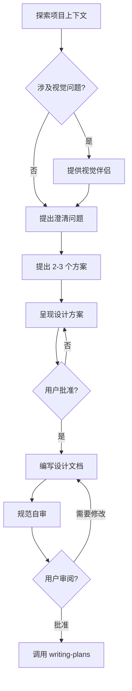

# 第4章：Brainstorming 技能

> 你有没有过这样的经历：让 AI 帮你开发一个功能，它上来就开始写代码，写了三百行之后你发现——它理解错了需求。你不得不从头来。
>
> Brainstorming 技能就是为了解决这个问题。它强制 AI 在动手之前先理解你要做什么，先设计方案，先获得你的批准。

## 4.1 HARD-GATE：核心规则

Brainstorming 技能的核心是 **HARD-GATE** 规则：

```markdown
<HARD-GATE>
Do NOT invoke any implementation skill, write any code, scaffold any project, or take any implementation action until you have presented a design and the user has approved it. This applies to EVERY project regardless of perceived simplicity.
</HARD-GATE>
```

**翻译成人话**：在用户批准设计之前，AI 不能写任何代码。没有任何例外。

### 为什么叫 HARD-GATE？

"Gate"（门）是一种控制通过的机制。"Hard"（硬）意味着这道门没有后门、没有捷径、没有例外。

### 反模式：太简单不需要设计

> "这只是一个 todo 列表而已，不需要设计吧？"

**不，每个项目都经过此过程。**

"简单"项目正是未经检验的假设导致最多浪费工作的地方。设计可以很短（真正简单的项目几句话就够），但你必须呈现它并获得批准。

## 4.2 9 步检查清单

Brainstorming 定义了严格的 9 步检查清单：

| 步骤 | 内容 | 说明 |
|------|------|------|
| 1 | 探索项目上下文 | 检查文件、文档、最近的提交 |
| 2 | 提供视觉伴侣（可选） | 如果涉及视觉问题 |
| 3 | 提出澄清问题 | 一次一个，理解目的/约束/成功标准 |
| 4 | 提出 2-3 个方案 | 权衡利弊，给出推荐 |
| 5 | 呈现设计方案 | 按复杂度分段，每段后获批 |
| 6 | 编写设计文档 | 保存到 docs/superpowers/specs/ |
| 7 | 规范自审 | 检查占位符、矛盾、歧义 |
| 8 | 用户审阅书面规范 | 要求用户在继续前审阅 |
| 9 | 过渡到实现 | 调用 writing-plans 技能 |

### 流程图



## 4.3 理解需求

### 探索项目上下文

在提问之前，先了解当前项目状态：
- 检查现有文件结构
- 阅读相关文档
- 查看最近的提交记录

### 项目规模评估

**重要**：在提问详细问题之前，评估项目范围。

如果请求描述多个独立子系统（例如"构建一个包含聊天、文件存储、计费和数据分析的平台"），**立即标记**：

> "这个请求涉及多个独立的子系统。在开始细化细节之前，我建议我们先把它分解成子项目..."

### 澄清问题

一次只问一个问题。优先使用多选问题，但开放性问题也可以。

**好的问题示例**：
- "这个功能的主要用户是谁？"
- "数据需要持久化存储吗？"
- "有性能要求吗？"

**不好的问题示例**：
- "请详细描述你的需求，包括所有边界情况和技术约束"（太多问题）

### YAGNI 原则

**YAGNI = You Aren't Gonna Need It（你不会需要它）**

从所有设计中删除不必要的功能。问问自己："如果我不实现这个，用户真的无法使用吗？"

## 4.4 探索方案

### 提出 2-3 个方案

不要直接给答案，而是提出 2-3 个不同的方案，包括：
- 每个方案的权衡
- 你的推荐
- 推荐的理由

**示例**：

> "我想到三个方案来解决这个问题：
>
> **方案 A：使用数据库**
> - 优点：数据可靠，支持复杂查询
> - 缺点：需要运维，增加复杂性
>
> **方案 B：使用本地存储**
> - 优点：简单，无需服务器
> - 缺点：无法跨设备同步
>
> **方案 C：使用云存储 API**
> - 优点：无需运维，自动同步
> - 缺点：依赖第三方，可能有成本
>
> **我推荐方案 B**，因为这是一个 MVP，原型阶段不需要复杂的基础设施。"

## 4.5 呈现设计

### 分段呈现

设计不需要一次性全部呈现。根据复杂度分段：
- 简单的部分：几句话
- 复杂的部分：200-300 字

每段之后问："这样看起来对吗？"

### 设计隔离

设计时考虑隔离和清晰度：
- 将系统分解为更小的单元，每个单元有一个明确的目的
- 通过明确定义的接口通信
- 每个单元可以独立理解和测试

**自我检查**：
- 有人能在不阅读内部代码的情况下理解这个单元做什么吗？
- 你能改变内部实现而不破坏依赖者吗？

如果不能，边界需要改进。

### 在现有代码库中工作

- 在提议更改之前探索当前结构
- 遵循现有模式
- 如果现有代码有问题（如文件太大、边界不清晰），将改进作为设计的一部分

## 4.6 视觉伴侣（可选）

视觉伴侣是一个浏览器工具，用于在头脑风暴期间展示模拟、图表和视觉选项。

### 使用条件

当预期问题涉及视觉内容时提供：
- 模拟（Mockups）
- 布局比较
- 架构图
- 线框图

### 使用原则

**每个问题单独决定**：即使在用户接受后，也要为每个问题决定是否使用浏览器。

**测试**：用户通过**看它**比**读它**理解得更好吗？

| 问题类型 | 决策 |
|----------|------|
| "这个向导布局哪个更好？" | 用浏览器（视觉问题） |
| "这个功能的个性是什么意思？" | 用终端（概念问题） |

## 4.7 设计文档

### 保存位置

规范保存到：`docs/superpowers/specs/YYYY-MM-DD-<topic>-design.md`

这样便于版本管理和追溯。

### 文档自审

在提交用户审阅之前，AI 会进行自审：

| 检查项 | 问题 | 修复 |
|--------|------|------|
| 占位符 | 有"TBD"、"TODO"或含糊的要求吗？ | 修复它们 |
| 内部一致性 | 各节相互矛盾吗？ | 修复矛盾 |
| 范围检查 | 这个范围适合单个实现计划吗？ | 必要时分解 |
| 歧义检查 | 有多种解释的要求吗？ | 选一种并明确 |

### 用户审阅

自审后，要求用户审阅：

> "规范已编写并提交到 `<path>`。请审阅它，告诉我们是否想在开始编写实现计划之前做任何更改。"

等待用户响应。如果他们请求更改，进行更改并重新运行自审循环。

## 4.8 过渡到实现

**唯一的后续技能是 `writing-plans`**。

不要调用 frontend-design、mcp-builder 或任何其他实现技能。Brainstorming 之后**唯一**的技能是 writing-plans。

## 4.9 关键原则

| 原则 | 说明 |
|------|------|
| 一次一个问题 | 不要用多个问题压倒用户 |
| 多选优于开放 | 可能时使用多选 |
| YAGNI 原则 | 删除不必要的功能 |
| 探索替代方案 | 始终提出 2-3 个方案 |
| 增量验证 | 呈现设计，获得批准后再继续 |
| 保持灵活 | 当事情没有意义时回去澄清 |

## 本章小结

本章深入讲解了 Brainstorming 技能：

- **HARD-GATE** 是核心规则：没有设计批准就没有代码
- **9 步检查清单**确保每个项目都经过完整的设计流程
- **项目规模评估**防止在太大或太复杂的项目上浪费时间
- **2-3 方案原则**确保探索了替代方案
- **分段审批**让用户更容易跟进
- **规范自审**确保文档质量

Brainstorming 是 Superpowers 工作流的起点。它确保在开始实现之前，AI 和用户对要构建的内容有共同的理解。

---

**延伸阅读**：

- [HARD-GATE 原则详解](file:///Users/yaya/.openclaw/workspace/superpowers/skills/brainstorming/SKILL.md)
- [Visual Companion 使用指南](file:///Users/yaya/.openclaw/workspace/superpowers/skills/brainstorming/visual-companion.md)

<!-- DRAFT_COMPLETE -->
