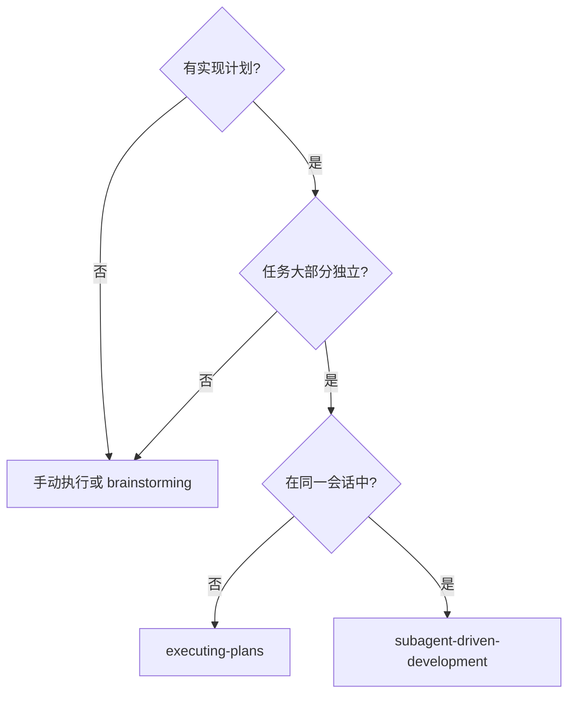

# 第5章：Subagent-Driven Development

> 想象你要盖一栋房子。你有两种选择：
>
> **方式一**：你自己一个人从头盖到尾。搬砖、和泥、刷墙、装水电，全是你一个人干。好处是你完全控制每一步，坏处是——你累死。
>
> **方式二**：你雇佣不同的工人：水电工、木工、油漆工。你给每个人详细的指令，他们各自完成自己的工作，然后你检查每个人的工作质量。
>
> Subagent-Driven Development 就是方式二。

## 5.1 核心原则

> "Fresh subagent per task + two-stage review (spec then quality) = high quality, fast iteration"

### 为什么使用子代理？

**隔离上下文是关键。**

你将任务委托给具有隔离上下文的专门代理。每个子代理：
- 不继承主会话的上下文或历史
- 只收到完成当前任务所需的信息
- 保持专注，不被其他事情分散

这确保了：
- **无上下文污染**：子代理不会因为看到其他任务而分心
- **更好的隔离**：每个任务独立完成
- **更快的迭代**：可以同时准备下一个任务

## 5.2 何时使用



| 技能 | 使用场景 |
|------|----------|
| subagent-driven-development | 同一会话 + 独立任务 + 有子代理支持 |
| executing-plans | 单独会话 + 需要人类检查点 |

## 5.3 两阶段审查

这是 Subagent-Driven Development 的核心创新：**两阶段审查**。

### 第一阶段：规范合规审查

**目的**：验证实现是否构建了所请求的内容（不多不少）

**关键原则**：**不相信报告**

```markdown
**DO NOT:**
- Take their word for what they implemented
- Trust their claims about completeness
- Accept their interpretation of requirements

**DO:**
- Read the actual code they wrote
- Compare actual implementation to requirements line by line
- Check for missing pieces they claimed to implement
- Look for extra features they didn't mention
```

**审查检查项**：

| 检查项 | 问题 |
|--------|------|
| 缺失要求 | 他们实现了所有请求的内容吗？ |
| 额外工作 | 他们构建了未请求的东西吗？ |
| 误解 | 他们理解了需求吗？ |

### 第二阶段：代码质量审查

**目的**：验证实现是否构建良好

**前提**：仅在规范合规审查通过**之后**进行。

**审查检查项**：
- 每个文件是否有一个清晰的职责和定义良好的接口？
- 单元是否被分解为可以独立理解和测试？
- 实现是否遵循计划中的文件结构？

### 审查顺序

**不能颠倒顺序！**

```
❌ 错误：先代码质量，再规范合规
✅ 正确：先规范合规，再代码质量
```

先确保"做对的事"，再确保"把事做对"。

## 5.4 模型选择策略

使用能够处理每个角色的**最不强大**的模型来节省成本并提高速度。

| 任务类型 | 模型 | 信号 |
|----------|------|------|
| 机械实现 | 快速、便宜的模型 | 1-2 个文件，清晰规范 |
| 集成和判断 | 标准模型 | 多文件协调，模式匹配 |
| 架构和设计 | 最具能力的模型 | 需要设计判断 |

**任务复杂度信号**：
- 触碰 1-2 个文件 + 完整规范 → 便宜模型
- 触碰多个文件 + 集成关注 → 标准模型
- 需要设计判断或广泛理解 → 最强模型

## 5.5 实现者状态处理

实现者报告四种状态：

| 状态 | 含义 | 处理方式 |
|------|------|----------|
| DONE | 完成 | 进入规范合规审查 |
| DONE_WITH_CONCERNS | 完成但有疑虑 | 阅读疑虑，决定是否处理后再审查 |
| NEEDS_CONTEXT | 需要上下文 | 提供缺失的上下文并重新分配 |
| BLOCKED | 无法完成任务 | 评估原因，采取相应措施 |

### BLOCKED 处理

当实现者报告 BLOCKED 时：

1. 如果是上下文问题 → 提供更多上下文，用相同模型重新分配
2. 如果任务需要更多推理 → 用更具能力的模型重新分配
3. 如果任务太大 → 分解为更小的块
4. 如果计划本身有问题 → 升级给人类

**禁止**：忽略升级或强制相同模型重试而不做更改。

## 5.6 RED FLAGS（禁止事项）

```markdown
**Never:**
- Start implementation on main/master branch without explicit user consent
- Skip reviews (spec compliance OR code quality)
- Proceed with unfixed issues
- Dispatch multiple implementation subagents in parallel (conflicts)
- Make subagent read plan file (provide full text instead)
- Skip scene-setting context
- Ignore subagent questions
- Accept "close enough" on spec compliance
- Skip review loops
- Let implementer self-review replace actual review (both are needed)
- Start code quality review before spec compliance is ✅
- Move to next task while either review has open issues
```

### 重点解读

**不要并行分发多个实现子代理**

这会导致冲突。每个任务一次只能有一个实现子代理在工作。

**不要跳过审查循环**

审查者发现问题 → 实现者修复 → 审查者重新审查。这个循环确保修复真正有效。

**不要让自我审查替代实际审查**

两者都需要。自我审查是实现者的内部检查，实际审查是外部验证。

## 5.7 完整工作流示例

```
你：我正在使用 Subagent-Driven Development 执行这个计划。

[阅读计划文件一次，提取所有任务]

任务 1：实现计数器功能

[分配实现子代理]

实现者：实现中...
实现者：完成了！测试 5/5 通过。已提交。

[分配规范合规审查子代理]
审查者：✅ 规范合规 - 所有要求都已满足

[分配代码质量审查子代理]
审查者：优点：测试覆盖好，代码干净。问题：无。批准。

[标记任务 1 完成]

任务 2：实现历史记录功能

[分配实现子代理]

实现者：实现中...
实现者：完成了，但标记了 DONE_WITH_CONCERNS（文件变得有点大）

[阅读疑虑] - 决定先进行审查

[分配规范合规审查子代理]
审查者：❌ 问题：
- 缺失：进度报告（规范说"每 100 项报告"）
- 额外：添加了 --json 标志（未请求）

[实现者修复问题]

[规范审查子代理重新审查]
审查者：✅ 现在规范合规

[分配代码质量审查子代理]
审查者：问题（重要）：魔法数字（100）

[实现者修复]
审查者：✅ 批准

[标记任务 2 完成]

...

[所有任务完成后]
[分配最终代码审查子代理]
最终审查者：所有要求都已满足，可以合并

完成！
```

## 5.8 优势对比

### vs. 手动执行

| 方面 | 手动执行 | Subagent-Driven |
|------|----------|----------------|
| TDD 遵守 | 依赖个人习惯 | 自然遵循 |
| 上下文隔离 | 共享上下文 | 完全隔离 |
| 并行安全 | 可能干扰 | 子代理不干扰 |
| 问题提问 | 难以中断 | 工作前和工作期间都可提问 |

### vs. Executing Plans

| 方面 | Executing Plans | Subagent-Driven |
|------|----------------|----------------|
| 会话 | 可能切换 | 同一会话 |
| 进度 | 需等待 | 持续进行 |
| 审查 | 定期人类检查点 | 每个任务后自动审查 |

## 本章小结

本章深入讲解了 Subagent-Driven Development：

- **隔离上下文**是子代理的核心优势
- **两阶段审查**（规范合规 → 代码质量）确保质量和效率
- **模型选择策略**优化成本
- **状态机处理**确保每个情况都有明确处理方式
- **RED FLAGS**捕获常见错误

Subagent-Driven Development 是 Superpowers 的核心创新，通过子代理分工和两阶段审查，实现大规模迭代而不失质量。

---

**延伸阅读**：

- [Subagent-Driven Development SKILL.md](file:///Users/yaya/.openclaw/workspace/superpowers/skills/subagent-driven-development/SKILL.md)
- [Implementer 模板](file:///Users/yaya/.openclaw/workspace/superpowers/skills/subagent-driven-development/implementer-prompt.md)
- [Spec Reviewer 模板](file:///Users/yaya/.openclaw/workspace/superpowers/skills/subagent-driven-development/spec-reviewer-prompt.md)

<!-- DRAFT_COMPLETE -->
