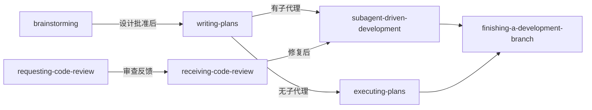
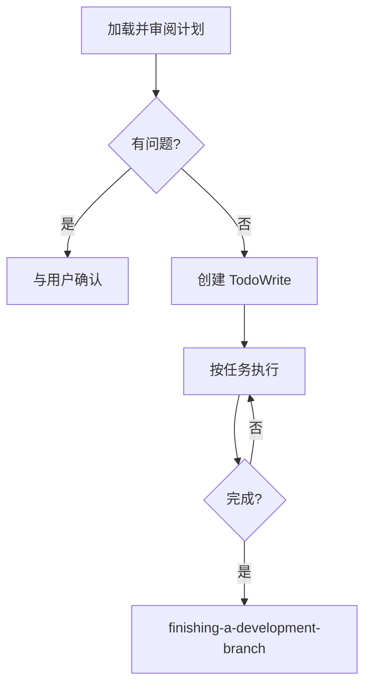
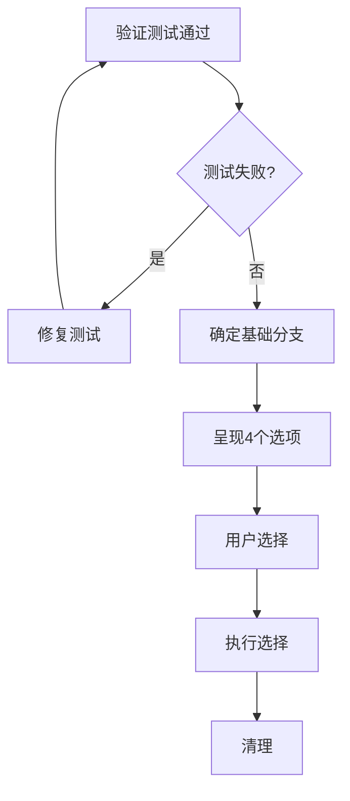

# 第6章：其他核心技能

> 除了 Brainstorming 和 Subagent-Driven Development，Superpowers 还提供了一系列其他核心技能，它们共同构成了完整的开发工作流。
>
> 本章我们将了解这些技能：writing-plans、executing-plans、receiving-code-review 和 finishing-a-development-branch。

## 6.1 技能协作概览

在深入每个技能之前，让我们看看它们是如何协作的：



**工作流概述**：
1. **brainstorming** → 设计规范
2. **writing-plans** → 实现计划
3. **subagent-driven-development** 或 **executing-plans** → 执行
4. **finishing-a-development-branch** → 完成

## 6.2 writing-plans — 实现计划编写

### 核心原则

> "Write comprehensive implementation plans assuming the engineer has zero context for our codebase and questionable taste."

**假设**：工程师有技能但没有上下文。

### 计划结构

```markdown
# [Feature Name] Implementation Plan

> **For agentic workers:** REQUIRED SUB-SKILL: Use superpowers:subagent-driven-development

**Goal:** [一句话描述构建内容]

**Architecture:** [2-3 句话描述方法]

**Tech Stack:** [关键技术/库]

---

### Task N: [组件名称]

**Files:**
- Create: `exact/path/to/file.py`
- Modify: `exact/path/to/existing.py:123-145`
- Test: `tests/exact/path/to/test.py`

- [ ] **Step 1: Write the failing test**

```python
def test_specific_behavior():
    result = function(input)
    assert result == expected
```

- [ ] **Step 2: Run test to verify it fails**

Run: `pytest tests/path/test.py::test_name -v`
Expected: FAIL with "function not defined"

- [ ] **Step 3: Write minimal implementation**

```python
def function(input):
    return expected
```

- [ ] **Step 4: Run test to verify it passes**

- [ ] **Step 5: Commit**
```

### 关键要求

| 要求 | 说明 |
|------|------|
| 步骤粒度 | 每个步骤 2-5 分钟 |
| 上下文假设 | 假设执行者没有上下文 |
| 原则 | DRY、YAGNI、TDD、频繁提交 |
| 保存位置 | `docs/superpowers/plans/YYYY-MM-DD-<feature-name>.md` |

### 文件结构设计

在定义任务之前，先规划哪些文件将被创建或修改：

- 设计单元边界清晰、接口定义良好的文件
- 每个文件应该有一个清晰的职责
- 一起变化的文件应该放在一起
- 在现有代码库中，遵循现有模式

## 6.3 executing-plans — 计划执行

### 何时使用

当**没有子代理支持**时使用 executing-plans。

> "Note: Superpowers works much better with access to subagents. If subagents are available, use subagent-driven-development instead."

### 执行流程



### 与 subagent-driven-development 的对比

| 方面 | subagent-driven-development | executing-plans |
|------|---------------------------|----------------|
| 子代理支持 | 需要 | 不需要 |
| 会话 | 同一会话 | 可能切换 |
| 审查 | 每个任务后自动 | 定期人类检查点 |
| 质量 | 两阶段自动审查 | 依赖人工检查 |

## 6.4 receiving-code-review — 接收代码审查

### 核心原则

> "Code review requires technical evaluation, not emotional performance."

代码审查需要技术评估，而不是情感表演。

### 响应模式

```
WHEN receiving code review feedback:

1. READ: Complete feedback without reacting
2. UNDERSTAND: Restate requirement in own words (or ask)
3. VERIFY: Check against codebase reality
4. EVALUATE: Technically sound for THIS codebase?
5. RESPOND: Technical acknowledgment or reasoned pushback
6. IMPLEMENT: One item at a time, test each
```

### 禁止的响应

```markdown
**NEVER:**
- "You're absolutely right!" (explicit violation)
- "Great point!" / "Excellent feedback!" (performative)
- "Let me implement that now" (before verification)

**INSTEAD:**
- Restate the technical requirement
- Ask clarifying questions
- Push back with technical reasoning if wrong
- Just start working (actions > words)
```

### 处理不清晰的反馈

```
IF any item is unclear:
  STOP - do not implement anything yet
  ASK for clarification on unclear items

WHY: Items may be related. Partial understanding = wrong implementation.
```

**示例**：

```
用户："修复 1-6"
你理解 1,2,3,6。对 4,5 不清楚。

❌ 错误：先实现 1,2,3,6，稍后再问 4,5
✅ 正确："我理解项目 1,2,3,6。在继续之前需要澄清 4 和 5。"
```

## 6.5 finishing-a-development-branch — 完成开发分支

### 完成流程



### 4 个选项

```
实现完成。你想做什么？

1. 本地合并到 <base-branch>
2. 推送并创建 Pull Request
3. 保留分支（稍后处理）
4. 丢弃此工作

哪个选项？
```

**注意**：不要添加解释，保持选项简洁。

### 测试验证

**硬性要求**：测试必须通过才能继续。

如果测试失败：

```
测试失败（<N> 个失败）。必须在完成之前修复：

[显示失败]

在测试通过之前无法继续合并/PR。
```

## 6.6 核心原则贯穿

### YAGNI 原则

**YAGNI = You Aren't Gonna Need It（你不会需要它）**

从所有设计中删除不必要的功能。

### DRY 原则

**DRY = Don't Repeat Yourself（不要重复自己）**

每个知识在系统中应该只有一个、明确的表示。

### TDD 原则

**TDD = Test-Driven Development（测试驱动开发）**

先写测试，再写实现。

### 频繁提交

每次完成一个步骤就提交，而不是等到最后才提交。

## 6.7 技能决策矩阵

| 场景 | 使用的技能 |
|------|------------|
| 需要理解需求 | brainstorming |
| 需要创建实现计划 | writing-plans |
| 有子代理，执行独立任务 | subagent-driven-development |
| 无子代理，执行计划 | executing-plans |
| 收到审查反馈 | receiving-code-review |
| 完成开发，准备合并 | finishing-a-development-branch |

## 本章小结

本章讲解了其他核心技能：

- **writing-plans** 假设执行者没有上下文，输出完整的实现计划
- **executing-plans** 用于无子代理支持的平台，定期有人类检查点
- **receiving-code-review** 强调技术评估而非情感表演
- **finishing-a-development-branch** 提供结构化的 4 选项完成流程

这些技能与 Brainstorming 和 Subagent-Driven Development 共同构成了 Superpowers 的完整工作流。

---

**延伸阅读**：

- [writing-plans SKILL.md](file:///Users/yaya/.openclaw/workspace/superpowers/skills/writing-plans/SKILL.md)
- [executing-plans SKILL.md](file:///Users/yaya/.openclaw/workspace/superpowers/skills/executing-plans/SKILL.md)
- [receiving-code-review SKILL.md](file:///Users/yaya/.openclaw/workspace/superpowers/skills/receiving-code-review/SKILL.md)
- [finishing-a-development-branch SKILL.md](file:///Users/yaya/.openclaw/workspace/superpowers/skills/finishing-a-development-branch/SKILL.md)

<!-- DRAFT_COMPLETE -->
