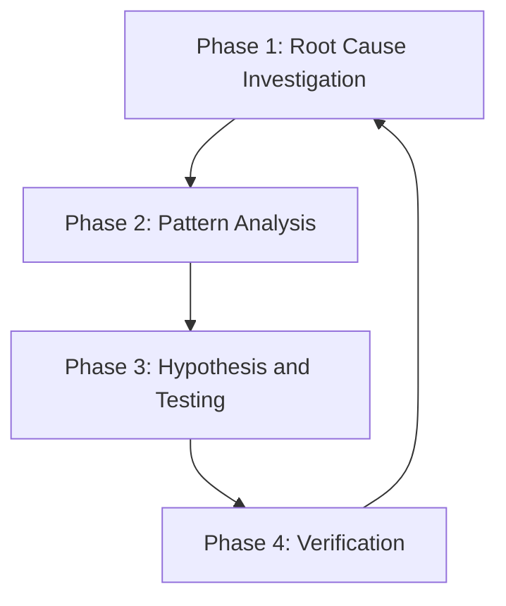

# 第7章：Systematic Debugging

> 你有没有过这样的经历：程序出了 bug，你看了看错误信息，觉得大概是哪里出了问题，于是改了几行代码。运行——还是报错。再改——还是报错。又改——终于不报错了。但程序的行为还是不对。
>
> 你花了两个小时，但问题没解决。
>
> Systematic Debugging 就是为了解决这个问题。

## 7.1 铁律

Systematic Debugging 的核心是**铁律**：

```
NO FIXES WITHOUT ROOT CAUSE INVESTIGATION FIRST
```

**翻译**：没有根本原因调查，就不能修复。

这意味着：在你完成调查阶段之前，你不能提议任何修复。

### 反模式：快速修复

> "这只是一个简单的问题，我直接改一下就好了。"

**不。即使问题看起来简单，也不要跳过调试过程。**

"简单"问题往往有复杂的根因。快速修复只是掩盖了症状，而不是解决问题。

### 为什么不要猜测

随机修复浪费时间并创造新的 bug。快速补丁掩盖了潜在问题。

## 7.2 四阶段流程

Systematic Debugging 定义了严格的四阶段流程：

| 阶段 | 内容 | 说明 |
|------|------|------|
| 1 | 根本原因调查 | 收集证据，理解问题 |
| 2 | 模式分析 | 找到工作的例子，理解差异 |
| 3 | 假设与测试 | 科学方法 |
| 4 | 验证 | 确保修复有效 |



**你必须完成每个阶段才能进入下一个阶段。**

## 7.3 Phase 1: 根本原因调查

### 仔细阅读错误信息

- 不要跳过错误或警告
- 它们通常包含确切的解决方案
- 完全阅读堆栈跟踪
- 记录行号、文件路径、错误代码

### 一致地复现

- 你能可靠地触发它吗？
- 确切的步骤是什么？
- 每次都发生吗？
- 如果不可复现 → 收集更多数据，**不要猜测**

### 检查最近的更改

- 什么改变了可能导致这个？
- Git diff、最近提交
- 新依赖、配置更改
- 环境差异

### 多组件系统收集证据

当系统有多个组件时（如 CI → build → signing，或 API → service → database）：

**在提议修复之前，添加诊断工具**：

```bash
# Layer 1: Workflow
echo "=== Secrets available in workflow: ==="
echo "IDENTITY: ${IDENTITY:+SET}${IDENTITY:-UNSET}"

# Layer 2: Build script
echo "=== Env vars in build script: ==="
env | grep IDENTITY || echo "IDENTITY not in environment"

# Layer 3: Signing script
echo "=== Keychain state: ==="
security list-keychains
security find-identity -v
```

### 追踪数据流

当错误在调用栈深处时：
- 坏值从哪里来的？
- 什么调用它时传入了坏值？
- 一直追踪到找到源头
- **在源头修复，而不是症状**

## 7.4 Phase 2: 模式分析

### 找到工作的例子

- 在相同代码库中找到类似工作的代码
- 什么工作了类似于什么坏了？

### 与参考比较

- 如果实现模式，完全阅读参考实现
- **不要略读 - 阅读每一行**
- 在应用之前完全理解模式

### 识别差异

- 工作的和坏的不同是什么？
- 列出每个差异，无论多小
- **不要假设"那不会影响"**

### 理解依赖

- 这个需要什么其他组件？
- 什么设置、配置、环境？
- 它做什么假设？

## 7.5 Phase 3: 假设与测试

**科学方法**：

1. **形成一个假设**
   - 清楚地陈述："我认为 X 是根本原因，因为 Y"

2. **测试假设**
   - 验证你的假设是否正确

3. **如果假设错误**
   - 形成新的假设
   - 重复

## 7.6 Phase 4: 验证

确保：
- 修复有效
- 没有引入新问题
- 测试全部通过

## 7.7 使用时机

**适用于任何技术问题**：
- 测试失败
- 生产中的 bug
- 意外行为
- 性能问题
- 构建失败
- 集成问题

**特别适用于**：
- 有时间压力时（紧急情况使猜测诱人）
- "只是一个快速修复"看起来很明显时
- 你已经尝试了多个修复
- 之前的修复没有工作
- 你不完全理解问题

**不要跳过当**：
- 问题看起来简单（简单 bug 也有根本原因）
- 你很着急（匆忙保证返工）
- 经理想要现在修复（系统化比折腾更快）

## 7.8 与 TDD 的关系

Systematic Debugging 与 Test-Driven Development 是互补的：

- **TDD**：通过先写测试来**防止** bug
- **Systematic Debugging**：通过系统化调查来**发现** bug

当 TDD 流程中发现 bug 时，使用 Systematic Debugging 来找到根因。

## 本章小结

本章深入讲解了 Systematic Debugging：

- **铁律**是核心：没有调查就不能修复
- **四阶段流程**确保系统化调查
- **不要猜测**是基本原则
- **复现优先**确保理解问题
- **源头修复**而不是症状修复

Systematic Debugging 是 Superpowers 工作流中处理问题的标准方法。它确保在修复之前真正理解问题，而不是盲目尝试。

---

**延伸阅读**：

- [Systematic Debugging SKILL.md](file:///Users/yaya/.openclaw/workspace/superpowers/skills/systematic-debugging/SKILL.md)
- [Root Cause Tracing](file:///Users/yaya/.openclaw/workspace/superpowers/skills/systematic-debugging/root-cause-tracing.md)

<!-- DRAFT_COMPLETE -->
