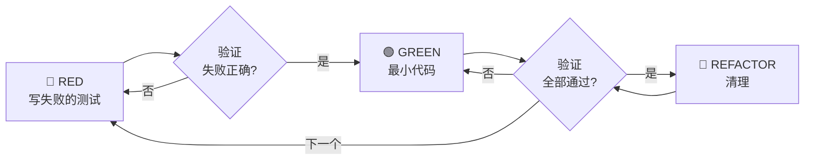

# 第8章：Test-Driven Development

> 你有没有过这样的经历：写了一段代码，测试了一下，看起来工作正常。提交。部署。客户报告 bug。
>
> 你回头看测试——测试通过了。但 bug 还在。
>
> TDD 就是为了解决这个问题。它确保你的测试真正测试了需要的东西。

## 8.1 铁律

TDD 的核心是**铁律**：

```
NO PRODUCTION CODE WITHOUT A FAILING TEST FIRST
```

**翻译**：没有失败的测试，就不能写生产代码。

### 核心原则

> "If you didn't watch the test fail, you don't know if it tests the right thing."

如果你没有看到测试失败，你就不知道它是否测试了正确的东西。

**没有例外**：
- 不要保留代码"作为参考"
- 不要"改编"它同时写测试
- 不要看它
- 删除意味着删除

从测试全新实现。就是这样。

## 8.2 红-绿-重构循环

TDD 遵循严格的三步循环：



### 🔴 RED — 写失败的测试

写一个展示应该发生什么的**最小**测试。

**好的测试示例**：
```typescript
test('retries failed operations 3 times', async () => {
  let attempts = 0;
  const operation = () => {
    attempts++;
    if (attempts < 3) throw new Error('fail');
    return 'success';
  };

  const result = await retryOperation(operation);

  expect(result).toBe('success');
  expect(attempts).toBe(3);
});
```

**不好的测试示例**：
```typescript
test('retry works', async () => {
  const mock = jest.fn()
    .mockRejectedValueOnce(new Error())
    .mockResolvedValueOnce('success');
  await retryOperation(mock);
  expect(mock).toHaveBeenCalledTimes(3);
});
```

**好的测试特征**：
- **最小**：一件事。名称里有"和"？分开。
- **清晰**：名称描述行为，不是"test1"
- **展示意图**：展示期望的 API

### ✅ Verify RED — 观看它失败

**强制。永远不要跳过。**

```bash
npm test path/to/test.test.ts
```

确认：
- 测试失败（不是错误）
- 失败消息符合预期
- 因为功能缺失而失败（不是拼写错误）

**测试通过了？** 你在测试现有行为。修复测试。

### 🟢 GREEN — 最小代码

写最简单的代码来通过测试。

**好的**：
```typescript
async function retryOperation<T>(fn: () => Promise<T>): Promise<T> {
  for (let i = 0; i < 3; i++) {
    try {
      return await fn();
    } catch (e) {
      if (i === 2) throw e;
    }
  }
  throw new Error('unreachable');
}
```

**不好的**：
```typescript
async function retryOperation<T>(
  fn: () => Promise<T>,
  options?: {
    maxRetries?: number;
    backoff?: 'linear' | 'exponential';
    onRetry?: (attempt: number) => void;
  }
): Promise<T> {
  // YAGNI - 不要添加未要求的功能
}
```

**YAGNI**：不要添加功能，不要重构其他代码，不要"改进"超出测试范围。

### ✅ Verify GREEN — 观看它通过

**强制。**

```bash
npm test path/to/test.test.ts
```

确认：
- 测试通过
- 其他测试仍然通过
- 输出干净（无错误、无警告）

**测试失败了？** 修复代码，不是测试。

**其他测试失败了？** 现在修复。

### 🔵 REFACTOR — 清理

**只有在绿色之后**：
- 移除重复
- 改进名称
- 提取辅助函数

保持测试绿色。**不要添加行为**。

## 8.3 为什么顺序重要

### "我之后再写测试来验证它工作"

测试之后写的测试立即通过。立即通过证明不了什么：
- 可能测试了错误的东西
- 可能测试实现，而不是行为
- 可能遗漏了你忘记的边界情况
- 你从未见过它捕获 bug

**测试优先迫使你看到测试失败，证明它真的测试了某些东西。**

### "我已经手动测试了所有边界情况"

手动测试是临时的。你以为测试了一切但：
- 没有记录你测试了什么
- 代码改变时不能重跑
- 在压力下容易忘记情况
- "我试的时候工作了" ≠ 全面

**自动化测试是系统化的。它们每次以相同方式运行。**

## 8.4 常见借口及真相

| 借口 | 真相 |
|------|------|
| "太简单不需要测试" | 简单代码也会坏。测试只需 30 秒。 |
| "我之后再测试" | 测试立即通过证明不了什么。 |
| "之后测试也能达到同样目标" | 之后测试 = "这做什么？" 测试优先 = "这应该做什么？" |
| "我已经手动测试了" | 临时 ≠ 系统。没有记录，无法重跑。 |
| "删除 X 小时的工作是浪费" | 沉没成本谬误。保留无法信任的代码是技术债务。 |
| "保留作为参考，先写测试" | 你会改编它。那就是之后测试。删除意味着删除。 |
| "需要先探索" | 可以。丢弃探索，从 TDD 开始。 |
| "测试难 = 设计不清楚" | 听测试的。难测试 = 难使用。 |
| "TDD 会拖慢我" | TDD 比调试快。务实 = 测试优先。 |
| "手动测试更快" | 手动不能证明边界情况。 |
| "现有代码没有测试" | 你在改进它。为现有代码添加测试。 |

## 8.5 RED FLAGS — 停止并重新开始

以下任何一项意味着：**删除代码。从 TDD 重新开始。**

- ❌ 代码在测试之前
- ❌ 测试在实现之后
- ❌ 测试立即通过
- ❌ 不能解释为什么测试失败
- ❌ 之后添加的测试
- ❌ 合理化"就这一次"
- ❌ "我已经手动测试了"
- ❌ "之后测试达到同样目的"
- ❌ "这是关于精神不是仪式"
- ❌ "保留作为参考"或"改编现有代码"
- ❌ "已经花了 X 小时，删除是浪费"
- ❌ "TDD 是教条，我很务实"
- ❌ "这不同因为..."

## 8.6 Bug 修复也用 TDD

即使修复 bug，也应该先写测试：

**Bug**：空 email 被接受

**RED**：
```typescript
test('rejects empty email', async () => {
  const result = await submitForm({ email: '' });
  expect(result.error).toBe('Email required');
});
```

**Verify RED**：
```bash
$ npm test
FAIL: expected 'Email required', got undefined
```

**GREEN**：
```typescript
function submitForm(data: FormData) {
  if (!data.email?.trim()) {
    return { error: 'Email required' };
  }
  // ...
}
```

**Verify GREEN**：
```bash
$ npm test
PASS
```

## 8.7 验证清单

完成工作之前，检查每一项：

| 检查项 | 状态 |
|--------|------|
| 每个新函数/方法都有测试 | ⬜ |
| 在实现之前观看每个测试失败 | ⬜ |
| 每个测试因预期原因失败（功能缺失，不是拼写错误） | ⬜ |
| 写最小代码来通过每个测试 | ⬜ |
| 所有测试通过 | ⬜ |
| 输出干净（无错误、无警告） | ⬜ |
| 测试使用真实代码（仅在不可避免时使用 mock） | ⬜ |
| 覆盖边界情况和错误 | ⬜ |

**不能勾选所有框？你跳过了 TDD。重新开始。**

## 本章小结

本章深入讲解了 Test-Driven Development：

- **铁律**是核心：没有失败测试就不能写代码
- **红-绿-重构循环**确保测试优先
- **顺序保证正确性**：先看到失败，证明测试有效
- **常见借口被反驳**：所有"务实"的借口实际上会增加问题
- **RED FLAGS**帮助识别何时需要重新开始

TDD 是 Superpowers 工作流中编写代码的标准方法。它确保测试真正测试了需要的东西，而不是代码碰巧做的事情。

---

**延伸阅读**：

- [TDD SKILL.md](file:///Users/yaya/.openclaw/workspace/superpowers/skills/test-driven-development/SKILL.md)
- [Testing Anti-Patterns](file:///Users/yaya/.openclaw/workspace/superpowers/skills/test-driven-development/testing-anti-patterns.md)

<!-- DRAFT_COMPLETE -->
