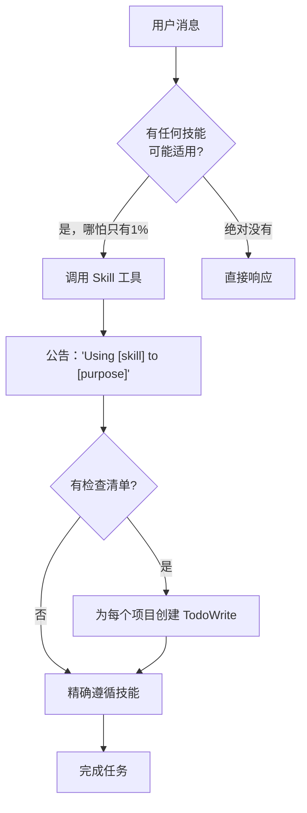

# 第9章：多平台适配

> Superpowers 不只是为 Claude Code 设计的。它可以运行在多种 AI 编程平台上。每个平台有不同的工具和接口，但 Superpowers 的核心原则保持不变。
>
> 本章将介绍如何在不同的 AI 编程平台上使用 Superpowers。

## 9.1 核心原则：1% 规则

使用 Superpowers 的核心是 **1% 规则**：

> "If you think there is even a 1% chance a skill might apply to what you are doing, you ABSOLUTELY MUST invoke the skill."

**翻译**：只要有 1% 的可能性技能适用，就必须调用技能来检查。

### 绝对重要

```markdown
<EXTREMELY-IMPORTANT>
If a skill applies to your task, you do not have a choice. You must use it.

This is not negotiable. This is not optional. You cannot rationalize your way out of this.
</EXTREMELY-IMPORTANT>
```

### RED FLAGS（理性化警示）

以下想法意味着停止——你在合理化：

| 想法 | 真相 |
|------|------|
| "这只是简单的问题" | 问题即任务。检查技能。 |
| "我需要先获取更多上下文" | 技能检查在澄清问题之前。 |
| "让我先探索代码库" | 技能告诉你如何探索。先检查。 |
| "这不需要正式技能" | 如果存在技能，就使用它。 |
| "我记得这个技能" | 技能会演进。读取当前版本。 |
| "我会先做这一件事" | 做任何事之前先检查。 |
| "我觉得这很有效" | 无纪律的行动浪费时间。技能防止这个。 |

## 9.2 指令优先级

Superpowers 技能覆盖默认系统提示行为，但**用户指令始终优先**：

| 优先级 | 指令类型 | 说明 |
|--------|----------|------|
| 1 | 用户的明确指令 | CLAUDE.md、GEMINI.md、AGENTS.md、直接请求 |
| 2 | Superpowers 技能 | 与默认行为冲突时覆盖 |
| 3 | 默认系统提示 | 最低优先级 |

如果用户指令说"不要使用 TDD"，而技能说"始终使用 TDD"，**遵循用户的指令**。用户说了算。

## 9.3 工具映射

不同的 AI 编程平台有不同的工具名称。以下是常见平台的工具映射：

### Claude Code vs Copilot CLI

| Claude Code | Copilot CLI | 用途 |
|-------------|-------------|------|
| `Read` | `view` | 读取文件 |
| `Write` | `create` | 创建文件 |
| `Edit` | `edit` | 编辑文件 |
| `Bash` | `bash` | 运行命令 |
| `Grep` | `grep` | 搜索文件内容 |
| `Glob` | `glob` | 按名称搜索文件 |
| `Skill` | `skill` | 调用技能 |
| `Task` | `task` | 分派子代理 |
| `TodoWrite` | `sql` + `todos` 表 | 任务跟踪 |

## 9.4 技能使用流程



### 公告增加透明度

使用技能时，公告你的意图：

> "I'm using the brainstorming skill to understand your requirements before implementation."

### 检查清单管理

如果技能有检查清单，为每个项目创建 TodoWrite：

```
TodoWrite:
- [ ] 探索项目上下文
- [ ] 提出澄清问题
- [ ] 提出 2-3 个方案
```

## 9.5 技能优先级

当多个技能可能适用时，使用此顺序：

| 优先级 | 技能类型 | 说明 |
|--------|----------|------|
| 1 | 流程技能 | brainstorming、debugging — 决定如何处理任务 |
| 2 | 实现技能 | frontend-design、mcp-builder — 指导执行 |

**决策示例**：

```
"Let's build X" → brainstorming 首先，然后实现技能
"Fix this bug" → debugging 首先，然后领域特定技能
```

## 9.6 技能类型

| 类型 | 说明 | 遵循方式 |
|------|------|----------|
| **Rigid（严格）** | 必须精确遵循。不适应掉纪律。 | 照搬 |
| **Flexible（灵活）** | 根据上下文调整原则。 | 适配 |

**示例**：

- **Rigid**：TDD、debugging — 规则不能改变
- **Flexible**：模式 — 可以根据上下文调整

技能本身会告诉你它是哪种类型。

## 9.7 平台特定配置

### Claude Code

```bash
# 安装 Superpowers
/claude plugin install superpowers@claude-plugins-official

# 技能位置
~/.claude/skills/
```

### Copilot CLI

```bash
# 安装 Superpowers
copilot plugin install superpowers

# 技能位置
~/.agents/skills/
```

### Gemini CLI

技能通过 `activate_skill` 工具激活。Gemini 在会话开始时加载技能元数据，按需激活完整内容。

## 9.8 用户指令 vs 技能

用户指令说 **WHAT**，不说 HOW：

- "Add X" 或 "Fix Y" **不**意味着跳过工作流
- 无论用户说什么，都必须遵循技能定义的过程

**示例**：

```
用户："Fix the login bug"
正确：systematic-debugging → 找到根因 → 修复
错误：直接改代码（跳过调试过程）
```

## 本章小结

本章讲解了多平台适配：

- **1% 规则**是核心：只要可能就要检查
- **工具映射**确保跨平台一致
- **用户指令优先**于技能
- **流程技能优先**于实现技能
- **Rigid 和 Flexible** 技能有不同的遵循方式

Superpowers 的核心原则在所有平台上保持不变，只是工具名称不同。

---

**延伸阅读**：

- [Using Superpowers SKILL.md](file:///Users/yaya/.openclaw/workspace/superpowers/skills/using-superpowers/SKILL.md)
- [Copilot CLI 工具映射](file:///Users/yaya/.openclaw/workspace/superpowers/skills/using-superpowers/references/copilot-tools.md)

<!-- DRAFT_COMPLETE -->
