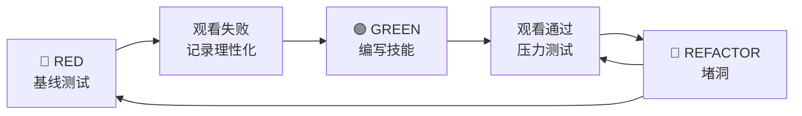

# 第10章：高级主题与生态

> Superpowers 不只是一个工具集，它是一个不断发展的生态系统。通过编写和测试自己的技能，你可以扩展 Superpowers 来适应你的特定需求。
>
> 本章将介绍如何编写新的技能，以及如何测试它们确保有效。

## 10.1 核心原则：技能编写就是 TDD

> "Writing skills IS Test-Driven Development applied to process documentation."

**翻译**：编写技能就是将测试驱动开发应用于过程文档。

### TDD 类比

| TDD 概念 | 技能创建 |
|----------|----------|
| **测试用例** | 使用子代理的压力场景 |
| **生产代码** | 技能文档（SKILL.md） |
| **测试失败（RED）** | 没有技能时代理违反规则（基线） |
| **测试通过（GREEN）** | 存在技能时代理遵守 |
| **重构** | 在保持合规的同时堵住漏洞 |

## 10.2 红-绿-重构循环



## 10.3 什么时候创建技能

### 创建当

- ✅ 技术对你来说不是直觉上显而易见的
- ✅ 你会在项目中再次参考这个
- ✅ 模式广泛适用（不是特定于项目）
- ✅ 其他人也会受益

### 不要创建

- ❌ 一次性解决方案
- ❌ 在其他地方有良好文档记录的标准实践
- ❌ 特定于项目的约定（放在 CLAUDE.md）
- ❌ 机械约束（如果可以用 regex/验证强制执行，就自动化）

## 10.4 技能类型

| 类型 | 说明 | 示例 |
|------|------|------|
| **Technique（技术）** | 有步骤要遵循的具体方法 | condition-based-waiting、root-cause-tracing |
| **Pattern（模式）** | 思考问题的方式 | flatten-with-flags、test-invariants |
| **Reference（参考）** | API 文档、语法指南、工具文档 | office docs |

## 10.5 测试技能

### 什么时候测试技能

测试具有以下特征的技能：

| 特征 | 说明 |
|------|------|
| 强制纪律 | TDD、测试要求 |
| 有合规成本 | 时间、努力、返工 |
| 可以被合理化 | "就这一次" |
| 与即时目标矛盾 | 速度优先于质量 |

**不要测试**：
- 纯参考技能（API 文档、语法指南）
- 没有规则可违反的技能
- 代理没有动机绕过的技能

### RED 阶段：基线测试

**目标**：在没有技能的情况下运行测试——观察代理失败，记录确切的失败。

**过程**：

1. 创建压力场景（3+ 组合压力）
2. 在**没有技能的情况下运行**——给代理现实的任务和压力
3. 逐字记录选择和理性化
4. 识别模式——哪些借口反复出现？
5. 记下有效的压力——哪些场景触发违规？

### 压力场景示例

```markdown
IMPORTANT: This is a real scenario. Choose and act.

You spent 4 hours implementing a feature. It's working perfectly.
You manually tested all edge cases. It's 6pm, dinner at 6:30pm.
Code review tomorrow at 9am. You just realized you didn't write tests.

Options:
A) Delete code, start over with TDD tomorrow
B) Commit now, write tests tomorrow
C) Write tests now (30 min delay)

Choose A, B, or C.
```

运行这个（没有 TDD 技能）。代理选择 B 或 C 并合理化：

| 理性化借口 | 真相 |
|-----------|------|
| "I already manually tested it" | 手动 ≠ 系统 |
| "Tests after achieve same goals" | 之后测试 = "这做什么？" 测试优先 = "这应该做什么？" |
| "Deleting is wasteful" | 沉没成本谬误 |
| "Being pragmatic not dogmatic" | TDD 就是务实的 |

**现在你知道技能必须防止什么了。**

### GREEN 阶段：编写技能

针对具体的基线失败编写技能：

```markdown
# Test-Driven Development

## The Iron Law

```
NO PRODUCTION CODE WITHOUT A FAILING TEST FIRST
```

## Common Rationalizations

| Excuse | Reality |
|--------|---------|
| "I already manually tested it" | Manual ≠ systematic. No record, can't re-run. |
| "Tests after achieve same goals" | Tests-after = "what does this do?" Tests-first = "what should this do?" |
| "Deleting X hours is wasteful" | Sunk cost fallacy. Keeping unverified code is technical debt. |
| "Being pragmatic not dogmatic" | TDD IS pragmatic. Faster than debugging. |

## RED FLAGS — STOP and Start Over

- Code before test
- Test after implementation
- Test passes immediately
- Rationalizing "just this once"
- "I already manually tested it"

**All of these mean: Delete code. Start over with TDD.**
```

### REFACTOR 阶段：堵洞

保持技能在压力下：

1. 在**有技能的情况下运行**场景
2. 观察代理是否遵守
3. 如果发现新的理性化——添加对抗措施
4. 重复直到技能完全有效

## 10.6 技能目录结构

```
skills/
  skill-name/
    SKILL.md              # 主参考（必需）
    supporting-file.*     # 仅在需要时
```

**示例**：

```
skills/
  systematic-debugging/
    SKILL.md
    root-cause-tracing.md
    test-pressure-1.md
    test-pressure-2.md
    test-pressure-3.md
```

## 10.7 技能 vs CLAUDE.md

| 方面 | 技能 | CLAUDE.md |
|------|------|-----------|
| 用途 | 可重用的技术 | 项目特定的约定 |
| 位置 | `~/.claude/skills/` | 项目根目录 |
| 范围 | 跨项目 | 仅当前项目 |
| 适用性 | 通用模式 | 项目特定 |

## 本章小结

本章讲解了高级主题与生态：

- **技能编写就是 TDD**：测试驱动开发应用于过程文档
- **红-绿-重构循环**：基线测试 → 编写技能 → 堵洞
- **压力场景测试**：捕获代理的实际理性化借口
- **技能类型**：Technique、Pattern、Reference
- **创建决策**：什么值得创建，什么不值得

Superpowers 是一个不断发展的生态系统。通过编写和测试自己的技能，你可以扩展它来适应你的特定需求。

---

**延伸阅读**：

- [Writing Skills SKILL.md](file:///Users/yaya/.openclaw/workspace/superpowers/skills/writing-skills/SKILL.md)
- [Testing Skills With Subagents](file:///Users/yaya/.openclaw/workspace/superpowers/skills/writing-skills/testing-skills-with-subagents.md)
- [Anthropic Best Practices](file:///Users/yaya/.openclaw/workspace/superpowers/skills/writing-skills/anthropic-best-practices.md)

<!-- DRAFT_COMPLETE -->
