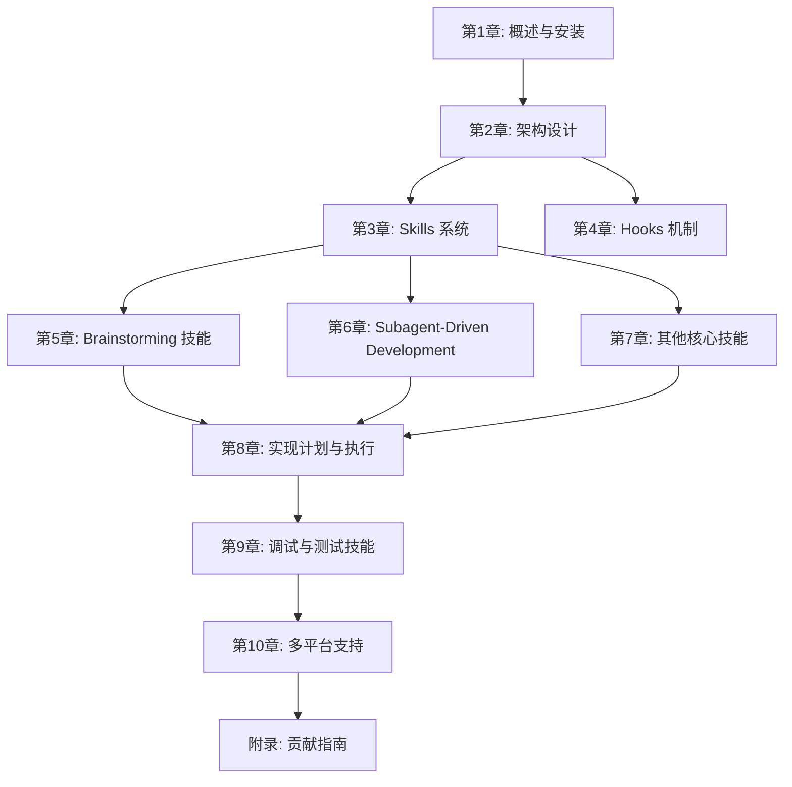

# Superpowers 源码解析：AI 编程助手的超能力框架

## 书籍信息

| 属性 | 值 |
|------|-----|
| 书名 | Superpowers 源码解析：AI 编程助手的超能力框架 |
| 副标题 | 从 Brainstorming 到 Subagent-Driven Development 的完整工作流 |
| 源码项目 | Superpowers v5.0.7 |
| 目标读者 | 有一定编程经验的开发者，尤其是使用 AI 辅助编程工具的人群 |
| 总章数 | 10 |
| 预计总字数 | 6万~8万字 |

## 全书概述

> Superpowers 是一个为 AI 编程助手（如 Claude Code、Cursor、OpenCode 等）提供结构化开发工作流的插件框架。本书通过深入分析 Superpowers 的源码，揭示其如何通过 Skills 系统、Hooks 机制和多平台适配层，让 AI 从"只会写代码"进化为"能够进行系统化设计、规范开发、持续迭代"的超级开发者。读完本书，读者将理解 AI 辅助编程的最佳实践，并能够将 Superpowers 的设计理念应用到自己的工具链中。

## 阅读路线图

---

## 第一部分：基础与架构

> 本部分介绍 Superpowers 的整体设计理念、架构组成和安装配置，为后续深入学习各模块打下基础。

### 第1章: Superpowers 概述与快速上手

| 属性 | 值 |
|------|-----|
| 核心主题 | 介绍 Superpowers 是什么，解决什么问题，如何安装和使用 |
| 覆盖源码 | README.md, CLAUDE.md, package.json |
| 前置依赖 | 无 |
| 难度 | ⭐ |
| 预计字数 | 5000字 |
| 关键产出 | 理解 Superpowers 的设计哲学，知道如何在各平台安装 |

#### 节级大纲

1. **Superpowers 是什么**
   - AI 编程助手的现状与局限
   - Superpowers 的设计理念：从"写代码"到"做工程"
   - 核心价值：结构化工作流、可组合技能、自主执行

2. **工作原理概览**
   - Skill（技能）系统的作用
   - Hook（钩子）机制如何触发技能
   - 多平台适配层的设计

3. **安装与配置**
   - Claude Code 安装指南
   - Cursor 安装指南
   - Codex 安装指南
   - OpenCode 安装指南
   - GitHub Copilot CLI 安装指南
   - Gemini CLI 安装指南

4. **快速体验**
   - 第一个 brainstorming 会话
   - 查看可用的 skills 列表
   - 理解"超能力"是如何生效的

---

### 第2章: 系统架构设计

| 属性 | 值 |
|------|-----|
| 核心主题 | 深入分析 Superpowers 的整体架构，理解各组件之间的关系 |
| 覆盖源码 | .opencode/plugins/superpowers.js, hooks/, agents/ |
| 前置依赖 | 第1章 |
| 难度 | ⭐⭐⭐⭐ |
| 预计字数 | 8000字 |
| 关键产出 | 理解 Superpowers 的分层架构：平台适配层、注入层、Skills 层 |

#### 节级大纲

1. **三层架构模型**
   - 平台适配层（Platform Adapter）
   - 上下文注入层（Context Injection）
   - 技能系统层（Skills System）

2. **插件系统深度解析**
   - superpowers.js 的设计与实现
   - frontmatter 解析逻辑
   - bootstrap 上下文生成
   - 配置文件修改机制

3. **Hooks 机制设计**
   - SessionStart hook 的触发逻辑
   - 多平台兼容实现（Claude Code/Cursor/Codex/Copilot）
   - JSON 输出格式适配

4. **项目目录结构**
   - skills/ 目录的组织方式
   - hooks/ 目录的作用
   - tests/ 测试体系
   - docs/ 文档结构

---

## 第二部分：核心技能系统

> 本部分深入分析 Superpowers 的 Skills 系统及其核心技能的实现原理。

### 第3章: Skills 系统实现

| 属性 | | 值 |
|------|------|-----|
| 核心主题 | 分析 Skills 系统的设计模式和实现机制 |
| 覆盖源码 | skills/*/SKILL.md, skills/writing-skills/SKILL.md |
| 前置依赖 | 第2章 |
| 难度 | ⭐⭐⭐⭐ |
| 预计字数 | 7000字 |
| 关键产出 | 理解 Skill 的 YAML frontmatter 规范、触发机制和编写模式 |

#### 节级大纲

1. **Skill 文件结构**
   - frontmatter 规范（name、description）
   - 内容结构（规则、流程图、提示词）
   - markdown 图形的使用（Mermaid、dot）

2. **Skill 触发机制**
   - Skill 工具的工作原理
   - 如何通过自然语言触发技能
   - 技能间的调用关系

3. **编写高质量 Skill 的原则**
   - 行为塑造内容 vs 普通文档
   - 测试驱动的技能开发
   - 迭代优化的方法论

4. **writing-skills 技能解析**
   - Skill 编写指南的核心要点
   - Anthropic 最佳实践的应用
   - 压力测试方法

---

### 第4章: Brainstorming 技能

| 属性 | 值 |
|------|-----|
| 核心主题 | 深入分析 Brainstorming 技能的设计原理和实现细节 |
| 覆盖源码 | skills/brainstorming/SKILL.md, skills/brainstorming/visual-companion.md |
| 前置依赖 | 第3章 |
| 难度 | ⭐⭐⭐⭐ |
| 预计字数 | 8000字 |
| 关键产出 | 理解如何通过结构化对话将模糊需求转化为精确设计规范 |

#### 节级大纲

1. **HARD-GATE 原则**
   - 为什么设计阶段不能跳过
   - 如何防止过早进入实现
   - "简单项目"的陷阱

2. **需求探索流程**
   - 项目上下文探索
   - 澄清问题的艺术（一次一问）
   - 方案对比与推荐

3. **设计呈现策略**
   - 分段呈现，逐步确认
   - 架构与组件划分
   - 数据流与错误处理

4. **设计文档编写**
   - 文档命名规范
   - 自检清单
   - 用户评审环节

5. **Visual Companion 扩展**
   - 视觉化设计的支持机制
   - brainstorming 脚本服务器

---

### 第5章: Subagent-Driven Development

| 属性 | 值 |
|------|-----|
| 核心主题 | 分析子代理驱动开发模式的设计与实现 |
| 覆盖源码 | skills/subagent-driven-development/, agents/ |
| 前置依赖 | 第4章 |
| 难度 | ⭐⭐⭐⭐⭐ |
| 预计字数 | 9000字 |
| 关键产出 | 理解如何通过子代理模式实现高质量、大规模迭代开发 |

#### 节级大纲

1. **为什么需要子代理**
   - 上下文污染问题
   - 任务隔离的必要性
   - 精确构造指令的重要性

2. **两阶段审查模式**
   - Spec Reviewer（规范符合性审查）
   - Code Quality Reviewer（代码质量审查）
   - 审查顺序的深层原因

3. **实现者子代理设计**
   - implementer-prompt.md 解析
   - 任务执行与自测
   - 提交与自检

4. **Spec Reviewer 设计**
   - 规范比对检查点
   - 差距识别与反馈

5. **Code Quality Reviewer 设计**
   - 代码质量维度
   - 可维护性检查

6. **模型选择策略**
   - 任务复杂度分级
   - 成本与速度权衡

---

### 第6章: 其他核心技能

| 属性 | 值 |
|------|-----|
| 核心主题 | 分析实现计划、代码审查等辅助技能的设计 |
| 覆盖源码 | skills/writing-plans/, skills/requesting-code-review/, skills/receiving-code-review/ |
| 前置依赖 | 第4章 |
| 难度 | ⭐⭐⭐ |
| 预计字数 | 7000字 |
| 关键产出 | 理解完整开发生命周期中的各个技能如何协同工作 |

#### 节级大纲

1. **writing-plans 技能**
   - 实现计划的结构
   - 任务拆解方法论
   - 验收标准设定

2. **requesting-code-review 技能**
   - 何时请求审查
   - 审查范围界定
   - 反馈处理流程

3. **receiving-code-review 技能**
   - 如何接受审查意见
   - 区分有效反馈与无效反馈
   - 修订与确认

4. **finishing-a-development-branch 技能**
   - 分支收尾工作流
   - 代码审查收尾
   - 提交与推送

5. **dispatching-parallel-agents 技能**
   - 并行任务调度策略
   - 依赖管理与同步

---

## 第三部分：工程实践

> 本部分关注 Superpowers 中的调试、测试和质量保障机制。

### 第7章: Systematic Debugging 技能

| 属性 | 值 |
|------|-----|
| 核心主题 | 分析系统化调试技能的设计和调试方法论 |
| 覆盖源码 | skills/systematic-debugging/SKILL.md, skills/systematic-debugging/*.md |
| 前置依赖 | 第6章 |
| 难度 | ⭐⭐⭐⭐ |
| 预计字数 | 7000字 |
| 关键产出 | 掌握系统化调试的方法论，理解条件等待和根因追踪技巧 |

#### 节级大纲

1. **防御式编程**
   - 多层防御理念
   - 快速失败原则

2. **条件等待模式**
   - 条件等待示例分析
   - 轮询策略优化
   - 等待时间设计

3. **Find Polluter 工具**
   - 污染检测原理
   - 单元测试中的应用

4. **根因追踪**
   - 问题定位方法
   - 测试压力方法

---

### 第8章: Test-Driven Development 技能

| 属性 | 值 |
|------|-----|
| 核心主题 | 分析 TDD 技能的设计和测试反模式规避 |
| 覆盖源码 | skills/test-driven-development/SKILL.md, skills/test-driven-development/testing-anti-patterns.md |
| 前置依赖 | 第7章 |
| 难度 | ⭐⭐⭐ |
| 预计字数 | 6000字 |
| 关键产出 | 理解真正的 TDD 实践和常见的测试反模式 |

#### 节级大纲

1. **TDD 核心原则**
   - 红-绿-重构循环
   - YAGNI 原则
   - DRY 原则

2. **测试反模式**
   - 过度测试
   - 脆弱测试
   - 误导性测试

3. **验证前置技能**
   - verification-before-completion 解析
   - 完成前的检查清单

---

## 第四部分：平台与生态

> 本部分关注 Superpowers 的多平台支持和社区生态。

### 第9章: 多平台适配

| 属性 | 值 |
|------|-----|
| 核心主题 | 分析 Superpowers 如何适配不同的 AI 编程助手平台 |
| 覆盖源码 | .opencode/plugins/superpowers.js, .cursor-plugin/, .codex/, hooks/ |
| 前置依赖 | 第2章 |
| 难度 | ⭐⭐⭐⭐ |
| 预计字数 | 8000字 |
| 关键产出 | 理解跨平台插件系统的设计模式，能够为新平台添加支持 |

#### 节级大纲

1. **Claude Code 平台集成**
   - Plugin 系统机制
   - marketplace 注册
   - 配置文件注入

2. **Cursor 平台集成**
   - Plugin 系统差异
   - hooks-cursor.json 适配

3. **Codex 平台集成**
   - 安装机制
   - 工具映射

4. **OpenCode 平台集成**
   - 插件 API 分析
   - 动态配置注入
   - 上下文注入策略

5. **GitHub Copilot CLI 和 Gemini CLI**
   - marketplace 机制
   - 简化适配方案

6. **平台差异与统一**
   - 工具名称映射表
   - hook 输出格式差异
   - 兼容性保障策略

---

### 第10章: 高级主题与生态

| 属性 | 值 |
|------|-----|
| 核心主题 | 探讨 Superpowers 的高级用法、Git Worktrees 集成和社区贡献指南 |
| 覆盖源码 | skills/using-git-worktrees/, skills/writing-plans/, agents/code-reviewer.md |
| 前置依赖 | 第9章 |
| 难度 | ⭐⭐⭐⭐ |
| 预计字数 | 6000字 |
| 关键产出 | 掌握高级使用技巧，了解如何参与 Superpowers 社区贡献 |

#### 节级大纲

1. **Git Worktrees 集成**
   - 并行开发工作流
   - 分支管理优化

2. **CLAUDE.md 贡献指南**
   - 贡献者行为准则
   - PR 质量要求
   - 94% PR 拒绝率背后的故事

3. **Skill 变更评估**
   - 为什么 Skill 变更需要测试
   - 压力测试方法
   - 评估证据要求

4. **生态扩展**
   - 发布自定义插件
   - 领域特定技能开发
   - 社区资源

---

## 附录

### 附录A: Superpowers 贡献指南精读

| 属性 | 值 |
|------|-----|
| 核心主题 | 深入解读 Superpowers 的贡献规范，理解高质量开源项目的运营之道 |
| 覆盖源码 | CLAUDE.md, .github/PULL_REQUEST_TEMPLATE.md, agents/code-reviewer.md |
| 前置依赖 | 第10章 |
| 难度 | ⭐⭐⭐ |
| 预计字数 | 5000字 |
| 关键产出 | 理解开源项目治理的最佳实践，学会提交高质量 PR |

#### 节级大纲

1. **AI 代理行为准则**
   - 为什么需要规范
   - PR 质量门槛
   - 人类审查的重要性

2. **PR 要求详解**
   - 模板填写指南
   - 搜索现有 PR
   - 差异化说明

3. **拒绝模式分析**
   - 依赖问题
   - 领域污染
   - 批量 PR 陷阱

4. **质量门槛设定**
   - 94% 拒绝率的合理性
   - 维护者视角
   - 社区健康保障
