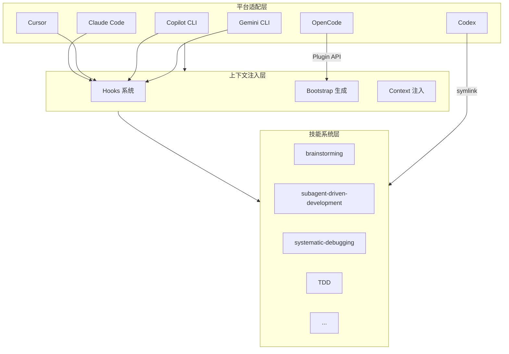

# 第2章研究报告：系统架构设计

## 研究概览

| 属性 | 值 |
|------|-----|
| 章节 | ch02: 系统架构设计 |
| 源码文件 | superpowers.js, session-start, hooks.json, hooks-cursor.json, using-superpowers/SKILL.md |
| 研究深度 | 完整阅读核心架构文件 |
| 关键发现 | 9 个核心发现 |

## 源码文件分析

### 1. superpowers.js — OpenCode 插件核心

**文件路径**: `/Users/yaya/.openclaw/workspace/superpowers/.opencode/plugins/superpowers.js`

**核心功能**:
1. **Frontmatter 解析** - 手写解析器，避免依赖（符合零依赖设计）
2. **Bootstrap 生成** - 生成包含 superpowers 上下文的引导内容
3. **Skills 目录注册** - 通过 config hook 自动注册
4. **上下文注入** - 通过消息转换注入 bootstrap

**关键代码结构**:

```javascript
export const SuperpowersPlugin = async ({ client, directory }) => {
  return {
    // 1. 注册 skills 目录
    config: async (config) => {
      config.skills.paths.push(superpowersSkillsDir);
    },

    // 2. 注入 bootstrap 上下文
    'experimental.chat.messages.transform': async (_input, output) => {
      // 找到第一个用户消息
      // 在消息内容前插入 bootstrap
    }
  };
};
```

**设计决策**:
- **为什么手写 frontmatter 解析？** 避免依赖，保持零依赖特性
- **为什么注入到用户消息而非系统消息？** 避免 token 膨胀（#750）和多系统消息破坏某些模型（#894）
- **为什么只注入一次？** 通过检查是否已存在 `EXTREMELY_IMPORTANT` 标记来避免重复注入

**问题追踪**:
- Issue #750: 系统消息导致 token 膨胀
- Issue #894: 多系统消息破坏 Qwen 等模型

### 2. session-start — 会话启动钩子

**文件路径**: `/Users/yaya/.openclaw/workspace/superpowers/hooks/session-start`

**核心功能**:
1. 读取 `using-superpowers/SKILL.md` 内容
2. 生成带 `<EXTREMELY_IMPORTANT>` 标签的上下文
3. 检测旧版 skills 目录并警告
4. 输出跨平台兼容的 JSON

**关键设计 - JSON 转义**:
```bash
escape_for_json() {
    local s="$1"
    s="${s//\\/\\\\}"    # 反斜杠
    s="${s//\"/\\\"}"    # 引号
    s="${s//$'\n'/\\n}"   # 换行
    s="${s//$'\r'/\\r}"   # 回车
    s="${s//$'\t'/\\t}"   # 制表符
    printf '%s' "$s"
}
```

**跨平台输出格式**:

| 平台 | 输出字段 | 触发条件 |
|------|----------|----------|
| Cursor | `additional_context` | `CURSOR_PLUGIN_ROOT` 存在 |
| Claude Code | `hookSpecificOutput.additionalContext` | `CLAUDE_PLUGIN_ROOT` 存在且无 `COPILOT_CLI` |
| Copilot CLI / 其他 | `additionalContext` | 其他情况 |

**旧版兼容警告**:
如果检测到 `~/.config/superpowers/skills`，输出警告提醒用户迁移。

### 3. hooks.json — Claude Code Hook 配置

**文件路径**: `/Users/yaya/.openclaw/workspace/superpowers/hooks/hooks.json`

```json
{
  "hooks": {
    "SessionStart": [
      {
        "matcher": "startup|clear|compact",
        "hooks": [
          {
            "type": "command",
            "command": "\"${CLAUDE_PLUGIN_ROOT}/hooks/run-hook.cmd\" session-start",
            "async": false
          }
        ]
      }
    ]
  }
}
```

**触发条件**:
- `startup` - 启动新会话
- `clear` - 清屏
- `compact` - 压缩上下文

**async: false** - 同步执行，确保 bootstrap 在会话开始前完成

### 4. hooks-cursor.json — Cursor Hook 配置

**文件路径**: `/Users/yaya/.openclaw/workspace/superpowers/hooks/hooks-cursor.json`

```json
{
  "version": 1,
  "hooks": {
    "sessionStart": [
      {
        "command": "./hooks/session-start"
      }
    ]
  }
}
```

**与 Claude Code 的差异**:
- 使用 `sessionStart` 而非 `SessionStart`（小写 s）
- 直接执行脚本而非通过 `run-hook.cmd`

### 5. using-superpowers/SKILL.md — 核心引导技能

**文件路径**: `/Users/yaya/.openclaw/workspace/superpowers/skills/using-superpowers/SKILL.md`

**核心规则**:

```markdown
<EXTREMELY-IMPORTANT>
If you think there is even a 1% chance a skill might apply to what you are doing, you ABSOLUTELY MUST invoke the skill.
</EXTREMELY-IMPORTANT>
```

**Red Flags（自检清单）**:
| 想法 | 真相 |
|------|------|
| "这只是简单问题" | 问题也是任务，检查 Skills |
| "我需要先了解更多上下文" | 先检查 Skills |
| "让我先探索代码库" | Skills 告诉你如何探索 |
| "这个不需要正式 Skill" | Skill 存在就要用 |
| "我记得这个 Skill" | Skill 在演进，用当前版本 |
| "我就先做这一件事" | 先检查再做 |

## 三层架构模型

### 架构图



### 各层职责

| 层级 | 职责 | 核心文件 |
|------|------|----------|
| 平台适配层 | 处理不同平台的差异 | hooks/*.json, superpowers.js |
| 上下文注入层 | 生成和注入 bootstrap | session-start, superpowers.js |
| 技能系统层 | 实现具体工作流程 | skills/*/SKILL.md |

## 关键发现

### 发现 1: 零依赖设计的技术代价

为了实现零依赖，代码需要手写很多基础功能（如 frontmatter 解析）。这是设计决策的权衡：减少了依赖管理复杂度，但增加了代码维护工作量。

### 发现 2: 上下文注入策略

选择将 bootstrap 注入到用户消息而非系统消息，避开了两个问题：
1. Token 膨胀（每次请求都会重复系统消息）
2. 多系统消息破坏某些模型

但这也有代价：依赖消息处理流程的特定实现。

### 发现 3: Hook 配置的平台差异

不同平台的 Hook 配置格式不同：
- Claude Code: `SessionStart`（大写 S）+ `hookSpecificOutput`
- Cursor: `sessionStart`（小写 s）+ `additional_context`

这种差异需要在 Hook 代码中通过环境变量检测来适配。

### 发现 4: JSON 转义的 bash 技巧

session-start 中的 JSON 转义使用 bash 参数扩展：
```bash
s="${s//$'\n'/\\n}"   # 单次 C 级别 pass
```

这比字符循环快几个数量级。展示了作者对 bash 性能的深刻理解。

### 发现 5: 一次性注入机制

通过在 bootstrap 中添加 `EXTREMELY_IMPORTANT` 标记，然后检查该标记是否存在，避免重复注入。这是一个巧妙的幂等设计。

### 发现 6: 旧版兼容警告

如果检测到旧版 skills 目录，会输出警告。这是向后兼容的考虑，帮助用户迁移。

### 发现 7: 1% 规则

using-superpowers Skill 中规定：只要有 1% 的可能性 Skill 适用，就必须调用 Skill。这是一个激进的规则，确保工作流不会被跳过。

### 发现 8: Red Flags 作为自检机制

通过列出"危险想法"（如"这只是简单问题"），帮助 AI 识别自己是否在合理化跳过 Skill。这是行为塑造的巧妙应用。

### 发现 9: Skill 优先级机制

当多个 Skill 可能适用时，定义了优先级顺序，避免冲突时的歧义。

## 写作要点

1. **架构图优先**: 用 Mermaid 展示三层架构，让读者先有全局认识
2. **代码分段展示**: superpowers.js 和 session-start 都较长，需要分块解释
3. **平台差异对比**: 用表格对比不同平台的 Hook 配置
4. **设计决策解释**: 每个关键设计都要解释"为什么"，不只是"是什么"
5. **bash 技巧说明**: JSON 转义的 bash 技巧值得专门讲解

## 预判的读者困惑

1. "为什么用 bash 而不是 JavaScript？" - 需要解释 Hook 执行的时机和环境
2. "JSON 转义为什么这么复杂？" - 需要解释 shell 特殊字符的处理
3. "为什么需要这么多平台适配？" - 需要解释 AI 编程助手生态的多样性

<!-- RESEARCH_COMPLETE -->
