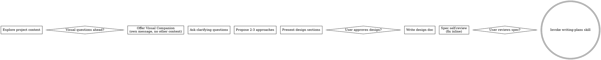

# 第4章研究报告：Brainstorming 技能

## 研究概览

| 属性 | 值 |
|------|-----|
| 章节 | ch04: Brainstorming 技能 |
| 源码文件 | brainstorming/SKILL.md, brainstorming/spec-document-reviewer-prompt.md, brainstorming/visual-companion.md |
| 研究深度 | 完整阅读主要文件 |
| 关键发现 | 10 个核心发现 |

## 源码文件分析

### 1. brainstorming/SKILL.md — 核心技能文档

**文件路径**: `/Users/yaya/.openclaw/workspace/superpowers/skills/brainstorming/SKILL.md`

**核心规则**:

```markdown
<HARD-GATE>
Do NOT invoke any implementation skill, write any code, scaffold any project, or take any implementation action until you have presented a design and the user has approved it.
</HARD-GATE>
```

**HARD-GATE 原则**: 在用户批准设计之前，绝对不能开始实现。这是一个硬性规则，没有例外。

### 检查清单

Brainstorming 技能定义了 9 个必须完成的步骤：

1. **探索项目上下文** — 检查文件、文档、最近的提交
2. **提供视觉伴侣**（如果主题涉及视觉问题）— 单独消息，不与澄清问题合并
3. **提出澄清问题** — 一次一个，理解目的/约束/成功标准
4. **提出 2-3 个方案** — 权衡利弊，并给出推荐
5. **呈现设计方案** — 按复杂度分段，用户对每段审批
6. **编写设计文档** — 保存到 `docs/superpowers/specs/YYYY-MM-DD-<topic>-design.md` 并提交
7. **规范自审** — 检查占位符、矛盾、歧义、范围
8. **用户审阅书面规范** — 要求用户在继续之前审阅规范文件
9. **过渡到实现** — 调用 writing-plans 技能创建实现计划

### 流程图



### 关键原则

- **一次一个问题** — 不要用多个问题压倒用户
- **多选优于开放** — 可能时使用多选，开放性问题也可以
- **YAGNI 原则** — 从所有设计中删除不必要的功能
- **探索替代方案** — 在确定之前始终提出 2-3 个方案
- **增量验证** — 呈现设计，获得批准后再继续
- **保持灵活** — 当事情没有意义时回去澄清

### 视觉伴侣（Visual Companion）

浏览器伴侣用于在头脑风暴期间展示模拟、图表和视觉选项。

**使用条件**：
- 提供视觉伴侣：仅当预期问题涉及视觉内容（模拟、布局、图表）时
- 每个问题的决定：即使在用户接受后，也要为每个问题决定是否使用浏览器
- 测试：**用户通过看它比读它理解得更好吗？**

### 反模式

**"这太简单了，不需要设计"**

每个项目都经过此过程。Todo 列表、单一功能工具、配置更改——所有这些。"简单"项目正是未经检验的假设导致最多浪费工作的地方。

### 项目规模评估

在提问详细问题之前，评估范围：
- 如果请求描述多个独立子系统（例如"构建一个包含聊天、文件存储、计费和数据分析的平台"），立即标记
- 如果项目太大无法单个规范，帮助用户分解为子项目
- 每个子项目获得自己的规范 → 计划 → 实现周期

## 关键发现

### 发现 1: HARD-GATE 是核心创新

HARD-GATE 是 Brainstorming 技能的核心——在用户批准设计之前，禁止任何实现动作。这是 Superpowers 与其他 AI 编程工具的根本区别。

### 发现 2: 9 步检查清单

Brainstorming 定义了严格的 9 步检查清单，确保每个项目都经过完整的设计流程。

### 发现 3: 视觉伴侣是可选增强

Visual Companion 是一个可选功能，不是核心流程的一部分。它降低了 token 消耗，适合视觉问题。

### 发现 4: 项目分解是关键技能

如果请求太大，Brainstorming 会帮助分解为子项目，而不是强行在单个规范中处理。

### 发现 5: 规范自审

在提交用户审阅之前，AI 会进行自审，检查：
- 占位符（"TBD"、"TODO"）
- 内部一致性
- 范围检查
- 歧义检查

### 发现 6: YAGNI 原则

始终应用"你不会需要它"（YAGNI）原则，从设计中删除不必要的功能。

### 发现 7: 2-3 方案原则

始终提出 2-3 个方案，包括权衡分析和推荐，而不是直接给出答案。

### 发现 8: 增量审批

设计按复杂度分段呈现，每段之后获得用户批准，而不是一次性全部呈现。

### 发现 9: 文档保存位置

规范保存到 `docs/superpowers/specs/YYYY-MM-DD-<topic>-design.md`，便于版本管理和追溯。

### 发现 10: 唯一的下一步

Brainstorming 完成后，唯一的后续技能是 `writing-plans`。不允许直接跳到实现。

## 写作要点

1. **HARD-GATE 优先**: 强调这是 Superpowers 的核心规则，没有例外
2. **流程图展示**: 用 Mermaid 展示 9 步流程
3. **反模式警示**: 专门讲解"太简单不需要设计"的陷阱
4. **实例演示**: 用一个具体案例展示完整流程
5. **视觉伴侣解释**: 解释何时使用、如何使用

## 预判的读者困惑

1. "为什么每个项目都要设计？" - 需要解释即使简单项目也有陷阱
2. "HARD-GATE 真的严格吗？" - 需要强调这是硬性规则
3. "什么时候分解项目？" - 需要给出具体标准

<!-- RESEARCH_COMPLETE -->
