# 第5章研究报告：Subagent-Driven Development

## 研究概览

| 属性 | 值 |
|------|-----|
| 章节 | ch05: Subagent-Driven Development |
| 源码文件 | subagent-driven-development/SKILL.md, implementer-prompt.md, spec-reviewer-prompt.md, code-quality-reviewer-prompt.md |
| 研究深度 | 完整阅读主要文件 |
| 关键发现 | 12 个核心发现 |

## 源码文件分析

### 1. subagent-driven-development/SKILL.md — 核心技能文档

**文件路径**: `/Users/yaya/.openclaw/workspace/superpowers/skills/subagent-driven-development/SKILL.md`

**核心原则**:

> "Fresh subagent per task + two-stage review (spec then quality) = high quality, fast iteration"

**为什么使用子代理**:
- 你将任务委托给具有隔离上下文的专门代理
- 通过精确地编写指令和上下文，确保它们保持专注并成功完成任务
- 它们永远不应该继承你的会话上下文或历史——你构建它们完全需要的东西
- 这也保留了你自己用于协调工作的上下文

### 使用场景决策

```dot
digraph when_to_use {
    "Have implementation plan?" [shape=diamond];
    "Tasks mostly independent?" [shape=diamond];
    "Stay in this session?" [shape=diamond];
    "subagent-driven-development" [shape=box];
    "executing-plans" [shape=box];
    "Manual execution or brainstorm first" [shape=box];
}
```



**选择 subagent-driven-development 的条件**:
- 有实现计划
- 任务大部分独立
- 在同一会话中

### 流程图

```dot
digraph process {
    rankdir=TB;
    subgraph cluster_per_task {
        "Dispatch implementer subagent" [shape=box];
        "Implementer subagent implements, tests, commits, self-reviews" [shape=box];
        "Dispatch spec reviewer subagent" [shape=box];
        "Spec reviewer confirms?" [shape=diamond];
        "Dispatch code quality reviewer subagent" [shape=box];
        "Code quality reviewer approves?" [shape=diamond];
        "Mark task complete" [shape=box];
    }
    // ... 完整流程
}
```



### 模型选择策略

使用能够处理每个角色的**最不强大**的模型来节省成本并提高速度：

| 任务类型 | 模型选择 | 信号 |
|----------|----------|------|
| 机械实现任务 | 快速、便宜的模型 | 1-2 个文件，清晰规范 |
| 集成和判断任务 | 标准模型 | 多文件协调，模式匹配 |
| 架构、设计和审查任务 | 最具能力的模型 | 需要设计判断或广泛理解 |

### 实现者状态处理

实现者报告四种状态之一：

| 状态 | 含义 | 处理方式 |
|------|------|----------|
| DONE | 完成 | 进入规范合规审查 |
| DONE_WITH_CONCERNS | 完成但有疑虑 | 阅读疑虑，决定是否处理 |
| NEEDS_CONTEXT | 需要上下文 | 提供缺失的上下文并重新分配 |
| BLOCKED | 无法完成任务 | 评估阻塞原因，采取相应措施 |

### 两阶段审查

**第一阶段：规范合规审查**
- 验证实现是否与规范匹配
- **不相信报告**——必须独立验证
- 检查缺失要求、额外工作、误解

**第二阶段：代码质量审查**
- 验证实现是否构建良好
- 仅在规范合规审查通过**之后**进行
- 检查清洁度、可测试性、可维护性

### RED FLAGS（禁止事项）

```
Never:
- Start implementation on main/master branch without explicit user consent
- Skip reviews (spec compliance OR code quality)
- Proceed with unfixed issues
- Dispatch multiple implementation subagents in parallel (conflicts)
- Make subagent read plan file (provide full text instead)
- Skip scene-setting context
- Ignore subagent questions
- Accept "close enough" on spec compliance
- Skip review loops
- Let implementer self-review replace actual review
- Start code quality review before spec compliance is ✅
- Move to next task while either review has open issues
```

## 关键发现

### 发现 1: 子代理驱动开发是 Superpowers 的核心创新

这是 Superpowers 与其他 AI 编程工具最不同的地方——通过子代理分工和两阶段审查，实现大规模迭代而不失质量。

### 发现 2: 隔离上下文是关键

子代理不应该继承主会话的上下文。相反，控制器构建它们完全需要的东西。这防止了上下文污染。

### 发现 3: 两阶段审查顺序严格

先规范合规（确保"做对的事"），再代码质量（确保"把事做对"）。这个顺序不能颠倒。

### 发现 4: 模型选择优化成本

使用能够处理任务的最低能力模型：
- 机械任务 → 便宜模型
- 集成任务 → 标准模型
- 架构任务 → 最强模型

### 发现 5: 状态机处理阻塞

四种状态（DONE, DONE_WITH_CONCERNS, NEEDS_CONTEXT, BLOCKED）确保每个情况都有明确的处理方式。

### 发现 6: 不相信报告

规范合规审查的核心原则：**不相信实现者的报告**。必须独立验证代码。

### 发现 7: RED FLAGS 防止常见错误

列出的 RED FLAGS 捕获了常见错误，如跳过审查、并行分发实现者等。

### 发现 8: 自我审查不能替代实际审查

实现者进行自我审查，但实际审查仍然需要。两者都需要。

### 发现 9: 审查循环确保修复有效

当审查发现问题时，实现者修复，然后重新审查。这确保修复真正有效。

### 发现 10: 示例工作流展示完整流程

SKILL.md 中的完整示例工作流展示了从任务提取到最终审查的每个步骤。

### 发现 11: 与 executing-plans 的对比

executing-plans 用于并行会话，subagent-driven-development 用于同一会话。决策树帮助选择正确的方法。

### 发现 12: 效率与质量的平衡

通过子代理和审查的开销换取：
- 更好的隔离
- 更快的迭代
- 更高的质量

## 写作要点

1. **子代理概念优先**: 解释为什么隔离上下文是关键
2. **两阶段审查图解**: 用 Mermaid 展示两阶段审查流程
3. **RED FLAGS 警示**: 强调禁止事项
4. **模型选择策略**: 解释如何优化成本
5. **完整示例**: 展示从任务到完成的整个流程

## 预判的读者困惑

1. "为什么要用子代理？" - 需要解释隔离上下文的好处
2. "为什么需要两阶段审查？" - 需要解释顺序的重要性
3. "什么时候用 executing-plans vs subagent-driven-development？" - 需要清晰的决策标准

## 跨章节引用

- 第4章 Brainstorming 会创建规范
- 第6章会讲解其他协作技能（executing-plans, writing-plans 等）

<!-- RESEARCH_COMPLETE -->
