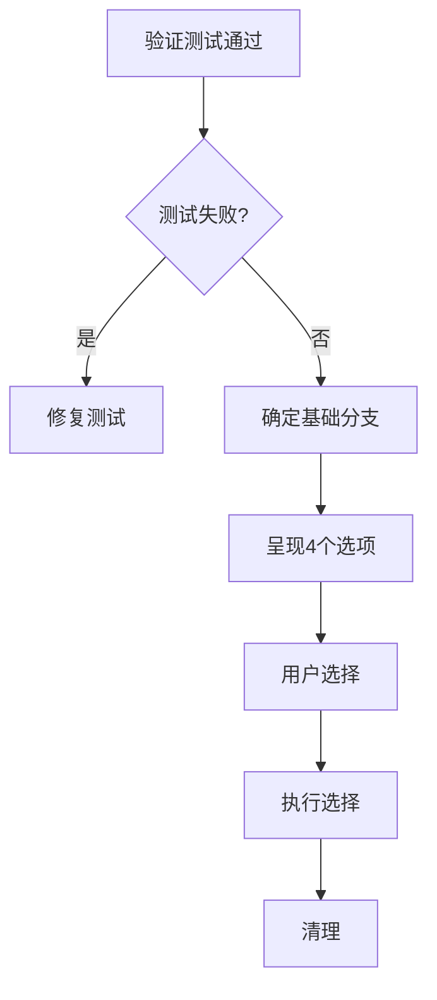
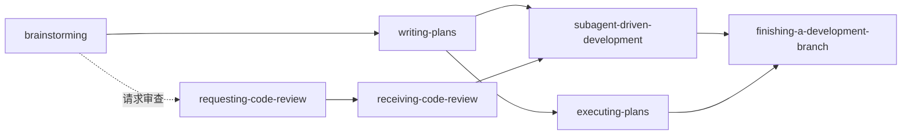

# 第6章研究报告：其他核心技能

## 研究概览

| 属性 | 值 |
|------|-----|
| 章节 | ch06: 其他核心技能 |
| 源码文件 | writing-plans, executing-plans, receiving-code-review, finishing-a-development-branch |
| 研究深度 | 完整阅读主要文件 |
| 关键发现 | 9 个核心发现 |

## 技能概览

第6章涵盖 Superpowers 中的其他核心协作技能，它们与 Brainstorming 和 Subagent-Driven Development 共同构成了完整的开发工作流。

## 源码文件分析

### 1. writing-plans — 实现计划编写

**文件路径**: `/Users/yaya/.openclaw/workspace/superpowers/skills/writing-plans/SKILL.md`

**核心原则**:

> "Write comprehensive implementation plans assuming the engineer has zero context for our codebase and questionable taste."

**规范结构**:

```markdown
# [Feature Name] Implementation Plan

> **For agentic workers:** REQUIRED SUB-SKILL: Use superpowers:subagent-driven-development

**Goal:** [One sentence describing what this builds]

**Architecture:** [2-3 sentences about approach]

**Tech Stack:** [Key technologies/libraries]

---

### Task N: [Component Name]

**Files:**
- Create: `exact/path/to/file.py`
- Modify: `exact/path/to/existing.py:123-145`
- Test: `tests/exact/path/to/test.py`

- [ ] **Step 1: Write the failing test**
- [ ] **Step 2: Run test to verify it fails**
- [ ] **Step 3: Write minimal implementation**
- [ ] **Step 4: Run test to verify it passes**
- [ ] **Step 5: Commit**
```

**关键要求**:
- 每个步骤 2-5 分钟
- 假设工程师没有上下文但有技能
- DRY、YAGNI、TDD、频繁提交
- 计划保存到 `docs/superpowers/plans/YYYY-MM-DD-<feature-name>.md`

### 2. executing-plans — 计划执行

**文件路径**: `/Users/yaya/.openclaw/workspace/superpowers/skills/executing-plans/SKILL.md`

**核心原则**:

> "Note: Superpowers works much better with access to subagents. If subagents are available, use subagent-driven-development instead."

**执行流程**:
1. 加载并审阅计划
2. 识别任何问题或疑虑
3. 如有问题，与用户确认后再开始
4. 按任务执行
5. 使用 finishing-a-development-branch 完成

**与 subagent-driven-development 的区别**:
- 用于没有子代理支持的平台
- 单会话执行
- 定期有人类检查点

### 3. receiving-code-review — 接收代码审查

**文件路径**: `/Users/yaya/.openclaw/workspace/superpowers/skills/receiving-code-review/SKILL.md`

**核心原则**:

> "Code review requires technical evaluation, not emotional performance."

**响应模式**:

```
WHEN receiving code review feedback:

1. READ: Complete feedback without reacting
2. UNDERSTAND: Restate requirement in own words (or ask)
3. VERIFY: Check against codebase reality
4. EVALUATE: Technically sound for THIS codebase?
5. RESPOND: Technical acknowledgment or reasoned pushback
6. IMPLEMENT: One item at a time, test each
```

**禁止的响应**:
- ❌ "You're absolutely right!"
- ❌ "Great point!"
- ❌ "Let me implement that now"

**正确的响应**:
- ✅ 重述技术要求
- ✅ 提问澄清
- ✅ 有技术理由地反驳
- ✅ 直接开始工作（行动 > 言语）

### 4. finishing-a-development-branch — 完成开发分支

**文件路径**: `/Users/yaya/.openclaw/workspace/superpowers/skills/finishing-a-development-branch/SKILL.md`

**完成流程**:



**4个选项**:
1. 本地合并到基础分支
2. 推送并创建 Pull Request
3. 保留分支稍后处理
4. 丢弃此工作

## 技能协作流程



## 关键发现

### 发现 1: 计划是"新人"视角

writing-plans 假设执行者没有上下文，因此计划需要包含所有必要信息。这是知识传递的关键。

### 发现 2: 步骤粒度 2-5 分钟

每个步骤应该是 2-5 分钟可以完成的动作。这确保了：
- 可管理的任务大小
- 频繁的成就感
- 更容易的错误定位

### 发现 3: receiving-code-review 强调技术而非社交

这个技能的核心洞察：代码审查需要技术评估，而不是情感表演。禁止"太好了！"等表演性响应。

### 发现 4: finishing-a-development-branch 提供结构化选项

完成开发时，提供清晰的 4 选项，而不是解释为什么要这样做。

### 发现 5: YAGNI/DRY 贯穿所有技能

YAGNI（你不会需要它）和 DRY（不要重复自己）是贯穿所有技能的核心原则。

### 发现 6: 子代理支持是关键差异

executing-plans 和 subagent-driven-development 的主要区别是子代理支持。后者用于有子代理的平台。

### 发现 7: 禁止的响应防止表演性

receiving-code-review 明确禁止"You're absolutely right!"等响应，因为它们是表演性的而非技术性的。

### 发现 8: 计划保存位置规范

计划保存到 `docs/superpowers/plans/`，规范保存到 `docs/superpowers/specs/`，便于版本管理。

### 发现 9: 测试验证是硬性要求

finishing-a-development-branch 要求测试必须通过才能继续。这是完成的条件。

## 写作要点

1. **技能协作图**: 用 Mermaid 展示技能之间的关系
2. **对比讲解**: executing-plans vs subagent-driven-development
3. **禁止响应警示**: 强调 receiving-code-review 的禁止响应
4. **实例展示**: 展示完整的计划文档结构
5. **完成流程**: finishing-a-development-branch 的 4 选项

## 预判的读者困惑

1. "writing-plans 和 brainstorming 的区别是什么？" - 需要清晰区分
2. "什么时候用 executing-plans vs subagent-driven-development？" - 需要决策标准
3. "为什么禁止说'太好了'？" - 需要解释技术评估 vs 表演

## 跨章节引用

- 第4章 Brainstorming 是计划的输入
- 第5章 Subagent-Driven Development 是执行的主要方式
- 第7章 Systematic Debugging 用于处理失败
- 第8章 TDD 贯穿计划执行

<!-- RESEARCH_COMPLETE -->
