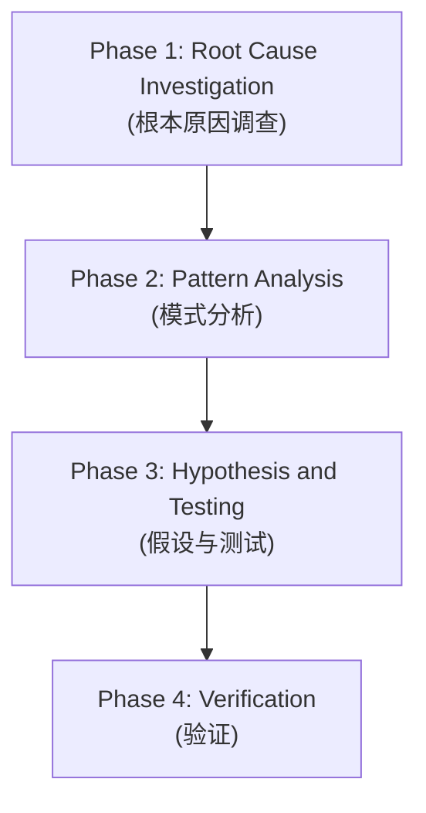

# 第7章研究报告：Systematic Debugging

## 研究概览

| 属性 | 值 |
|------|-----|
| 章节 | ch07: Systematic Debugging |
| 源码文件 | systematic-debugging/SKILL.md, root-cause-tracing.md, test-pressure-*.md, condition-based-waiting.md |
| 研究深度 | 完整阅读主要文件 |
| 关键发现 | 12 个核心发现 |

## 源码文件分析

### 1. systematic-debugging/SKILL.md — 核心技能文档

**文件路径**: `/Users/yaya/.openclaw/workspace/superpowers/skills/systematic-debugging/SKILL.md`

**核心原则**:

> "Random fixes waste time and create new bugs. Quick patches mask underlying issues."

**铁律**：

```
NO FIXES WITHOUT ROOT CAUSE INVESTIGATION FIRST
```

## 四阶段调试流程



### Phase 1: Root Cause Investigation

**在尝试任何修复之前必须完成**：

1. **仔细阅读错误信息**
   - 不要跳过错误或警告
   - 它们通常包含确切的解决方案
   - 完全阅读堆栈跟踪
   - 记录行号、文件路径、错误代码

2. **一致地复现**
   - 你能可靠地触发它吗？
   - 确切的步骤是什么？
   - 每次都发生吗？
   - 如果不可复现 → 收集更多数据，不要猜测

3. **检查最近的更改**
   - 什么改变了可能导致这个？
   - Git diff、最近提交
   - 新依赖、配置更改
   - 环境差异

4. **多组件系统收集证据**

   **添加诊断工具**：
   ```
   对于每个组件边界：
     - 记录进入组件的数据
     - 记录离开组件的数据
     - 验证环境/配置传播
     - 检查每层的状态
   ```

5. **追踪数据流**

   **当错误在调用栈深处时**：
   - 坏值从哪里来的？
   - 什么调用它时传入了坏值？
   - 一直追踪到找到源头
   - 在源头修复，而不是症状

### Phase 2: Pattern Analysis

**修复前先找到模式**：

1. **找到工作的例子**
   - 在相同代码库中找到类似工作的代码
   - 什么工作了类似于什么坏了？

2. **与参考比较**
   - 如果实现模式，完全阅读参考实现
   - 不要略读 - 阅读每一行
   - 在应用之前完全理解模式

3. **识别差异**
   - 工作的和坏的不同是什么？
   - 列出每个差异，无论多小
   - 不要假设"那不会影响"

4. **理解依赖**
   - 这个需要什么其他组件？
   - 什么设置、配置、环境？
   - 它做什么假设？

### Phase 3: Hypothesis and Testing

**科学方法**：

1. **形成一个假设**
   - 清楚地陈述："我认为 X 是根本原因，因为 Y"

### Phase 4: Verification

确保修复有效且不引入新问题。

## 使用时机

**适用于任何技术问题**：
- 测试失败
- 生产中的 bug
- 意外行为
- 性能问题
- 构建失败
- 集成问题

**特别适用于**：
- 有时间压力时（紧急情况使猜测诱人）
- "只是一个快速修复"看起来很明显时
- 你已经尝试了多个修复
- 之前的修复没有工作
- 你不完全理解问题

**不要跳过当**：
- 问题看起来简单（简单 bug 也有根本原因）
- 你很着急（匆忙保证返工）
- 经理想要现在修复（系统化比折腾更快）

## 关键原则

| 原则 | 说明 |
|------|------|
| 铁律 | 没有根本原因调查就不能修复 |
| 科学方法 | 形成假设，测试验证 |
| 不要猜测 | 没有数据就不要修复 |
| 复现第一 | 在修复前先能复现问题 |
| 源头修复 | 在源头修复，而不是症状 |

## 防御深度

Systematic Debugging 也包含防御深度策略：

- 防止相同类型 bug 再次出现的设计
- 预防胜于检测
- 让 bug 难以出现

## 测试压力技术

包含多个测试压力策略：

- `test-pressure-1.md`: 压力测试策略 1
- `test-pressure-2.md`: 压力测试策略 2
- `test-pressure-3.md`: 压力测试策略 3

## 关键发现

### 发现 1: 铁律是核心

"NO FIXES WITHOUT ROOT CAUSE INVESTIGATION FIRST" 是核心规则。没有例外。

### 发现 2: 四阶段流程

调试必须按顺序完成每个阶段：调查 → 分析 → 假设 → 验证。

### 发现 3: 不要猜测

Systematic Debugging 的核心原则：没有数据就不要猜测。

### 发现 4: 复现优先

在尝试修复之前，必须能够一致地复现问题。

### 发现 5: 多组件边界检查

在多组件系统中，添加诊断工具来收集证据。

### 发现 6: 数据流追踪

追踪数据从源头到错误位置的流动。

### 发现 7: 科学方法

使用假设和测试来验证根因。

### 发现 8: 模式分析

找到工作的例子，理解为什么它工作。

### 发现 9: 防止跳过

即使问题看起来简单，也不要跳过调试过程。

### 发现 10: 防御深度

设计防止相同类型 bug 的再次出现。

### 发现 11: 测试压力

包含压力测试策略来发现潜在问题。

### 发现 12: 条件等待

`condition-based-waiting.md` 包含处理条件等待的技术。

## 写作要点

1. **铁律优先**: 强调"没有调查就不能修复"的原则
2. **四阶段流程图**: 用 Mermaid 展示调试流程
3. **反模式警示**: "快速修复"和"猜测"的陷阱
4. **实例演示**: 用一个具体案例展示完整流程
5. **与其他技能关联**: 与 TDD 配合使用

## 预判的读者困惑

1. "调试看起来很简单，为什么要这么复杂？" - 需要解释为什么快速修复往往失败
2. "什么时候可以跳过？" - 需要强调不能跳过
3. "怎么判断根因找到了？" - 需要给出判断标准

## 跨章节引用

- 第8章 TDD 会讲解如何通过测试防止 bug
- 第4章 Brainstorming 的规范审查可以提前发现设计问题
- 第6章 finishing-a-development-branch 包含测试验证

<!-- RESEARCH_COMPLETE -->
