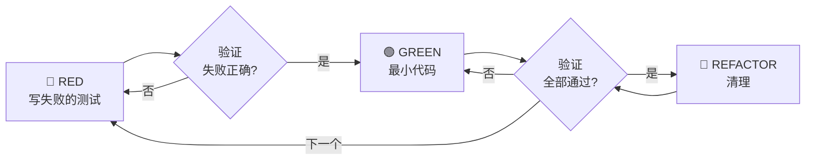

# 第8章研究报告：Test-Driven Development

## 研究概览

| 属性 | 值 |
|------|-----|
| 章节 | ch08: Test-Driven Development |
| 源码文件 | test-driven-development/SKILL.md, testing-anti-patterns.md |
| 研究深度 | 完整阅读主要文件 |
| 关键发现 | 12 个核心发现 |

## 源码文件分析

### 1. test-driven-development/SKILL.md — 核心技能文档

**文件路径**: `/Users/yaya/.openclaw/workspace/superpowers/skills/test-driven-development/SKILL.md`

**核心原则**:

> "If you didn't watch the test fail, you don't know if it tests the right thing."

**铁律**：

```
NO PRODUCTION CODE WITHOUT A FAILING TEST FIRST
```

## 红-绿-重构循环



### RED — 写失败的测试

写一个展示应该发生什么的最小测试。

**好的测试**：
```typescript
test('retries failed operations 3 times', async () => {
  let attempts = 0;
  const operation = () => {
    attempts++;
    if (attempts < 3) throw new Error('fail');
    return 'success';
  };

  const result = await retryOperation(operation);

  expect(result).toBe('success');
  expect(attempts).toBe(3);
});
```

**不好的测试**：
```typescript
test('retry works', async () => {
  const mock = jest.fn()
    .mockRejectedValueOnce(new Error())
    .mockResolvedValueOnce('success');
  await retryOperation(mock);
  expect(mock).toHaveBeenCalledTimes(3);
});
```

### Verify RED — 观看它失败

**强制。永远不要跳过。**

确认：
- 测试失败（不是错误）
- 失败消息符合预期
- 因为功能缺失而失败（不是拼写错误）

### GREEN — 最小代码

写最简单的代码来通过测试。

**好的**：
```typescript
async function retryOperation<T>(fn: () => Promise<T>): Promise<T> {
  for (let i = 0; i < 3; i++) {
    try {
      return await fn();
    } catch (e) {
      if (i === 2) throw e;
    }
  }
  throw new Error('unreachable');
}
```

**不好的**：
```typescript
async function retryOperation<T>(
  fn: () => Promise<T>,
  options?: {
    maxRetries?: number;
    backoff?: 'linear' | 'exponential';
    onRetry?: (attempt: number) => void;
  }
): Promise<T> {
  // YAGNI
}
```

### Verify GREEN — 观看它通过

**强制。**

确认：
- 测试通过
- 其他测试仍然通过
- 输出干净（无错误、无警告）

### REFACTOR — 清理

只有在绿色之后：
- 移除重复
- 改进名称
- 提取辅助函数

保持测试绿色。不要添加行为。

## 常见借口及真相

| 借口 | 真相 |
|------|------|
| "太简单不需要测试" | 简单代码也会坏。测试只需 30 秒。 |
| "我之后再测试" | 测试立即通过证明不了什么。 |
| "之后测试也能达到同样目标" | 之后测试 = "这做什么？" 测试优先 = "这应该做什么？" |
| "我已经手动测试了" | 临时 ≠ 系统。没有记录，无法重跑。 |
| "删除 X 小时的工作是浪费" | 沉没成本谬误。保留无法信任的代码是技术债务。 |
| "保留作为参考，先写测试" | 你会改编它。那就是之后测试。删除意味着删除。 |
| "需要先探索" | 可以。丢弃探索，从 TDD 开始。 |
| "测试难 = 设计不清楚" | 听测试的。难测试 = 难使用。 |
| "TDD 会拖慢我" | TDD 比调试快。务实 = 测试优先。 |
| "手动测试更快" | 手动不能证明边界情况。 |
| "现有代码没有测试" | 你在改进它。为现有代码添加测试。 |

## RED FLAGS — 停止并重新开始

- 代码在测试之前
- 测试在实现之后
- 测试立即通过
- 不能解释为什么测试失败
- 之后添加的测试
- 合理化"就这一次"
- "我已经手动测试了"
- "之后测试达到同样目的"
- "这是关于精神不是仪式"
- "保留作为参考"或"改编现有代码"
- "已经花了 X 小时，删除是浪费"
- "TDD 是教条，我很务实"
- "这不同因为..."

**所有这些意味着：删除代码。从 TDD 重新开始。**

## 好测试的特征

| 质量 | 好 | 不好 |
|------|-----|------|
| **最小** | 一件事。名称里有"和"？分开。 | `test('validates email and domain and whitespace')` |
| **清晰** | 名称描述行为 | `test('test1')` |
| **展示意图** | 展示期望的 API | 掩盖代码应该做什么 |

## 为什么顺序重要

**"我会之后再写测试来验证它工作"**

代码之后写的测试立即通过。立即通过证明不了什么：
- 可能测试了错误的东西
- 可能测试实现，而不是行为
- 可能遗漏了你忘记的边界情况
- 你从未见过它捕获 bug

测试优先迫使你看到测试失败，证明它真的测试了某些东西。

**"我已经手动测试了所有边界情况"**

手动测试是临时的。你以为测试了一切但：
- 没有记录你测试了什么
- 代码改变时不能重跑
- 在压力下容易忘记情况
- "我试的时候工作了" ≠ 全面

自动化测试是系统化的。它们每次以相同方式运行。

## 验证清单

完成工作之前：

- [ ] 每个新函数/方法都有测试
- [ ] 在实现之前观看每个测试失败
- [ ] 每个测试因预期原因失败（功能缺失，不是拼写错误）
- [ ] 写最小代码来通过每个测试
- [ ] 所有测试通过
- [ ] 输出干净（无错误、无警告）
- [ ] 测试使用真实代码（仅在不可避免时使用 mock）
- [ ] 覆盖边界情况和错误

不能勾选所有框？你跳过了 TDD。重新开始。

## 关键发现

### 发现 1: 铁律是核心

"NO PRODUCTION CODE WITHOUT A FAILING TEST FIRST" 是核心规则。代码在测试之前？删除并重新开始。

### 发现 2: 红-绿-重构循环

TDD 遵循严格的三步循环：RED（写失败测试）→ GREEN（最小代码）→ REFACTOR（清理）。

### 发现 3: 顺序保证正确性

测试优先的顺序确保测试真正测试了需要的东西，而不是代码碰巧做的事情。

### 发现 4: 常见借口被反驳

TDD 技能明确反驳了所有常见借口，如"之后测试也一样"、"手动测试就够了"等。

### 发现 5: RED FLAGS 防止欺骗

RED FLAGS 列表帮助识别何时跳过了 TDD，需要重新开始。

### 发现 6: 好测试的特征

好测试是最小的、清晰的、展示意图的。

### 发现 7: YAGNI 适用于 GREEN

在 GREEN 阶段，不要添加未要求的功能。只写通过测试所需的最小代码。

### 发现 8: 保持绿色

在重构阶段，保持所有测试绿色。不要添加行为。

### 发现 9: Bug 修复也用 TDD

即使修复 bug，也应该先写测试（TDD），确保 bug 被真正捕获。

### 发现 10: 陷入时怎么办

当不知道如何测试时，写期望的 API。先写断言。

### 发现 11: 测试揭示设计

难以测试通常意味着设计有问题。应该简化设计而不是简化测试。

### 发现 12: 技术债务视角

没有真正测试的"工作代码"是技术债务。删除并用 TDD 重写比保留更务实。

## 写作要点

1. **铁律优先**: 强调"没有失败测试就不能写代码"的原则
2. **红-绿-重构流程图**: 用 Mermaid 展示循环
3. **借口与反驳**: 展示常见借口并给出真相
4. **RED FLAGS 警示**: 强调何时需要重新开始
5. **验证清单**: 提供完成前的检查表

## 预判的读者困惑

1. "TDD 看起来很慢，为什么要这么做？" - 需要解释为什么测试优先实际上更快
2. "什么时候可以跳过？" - 需要强调没有例外
3. "已有的代码没有测试怎么办？" - 需要给出处理方式

## 跨章节引用

- 第7章 Systematic Debugging 与 TDD 互补
- 第6章 writing-plans 包含 TDD 步骤
- 第5章 Subagent-Driven Development 包含 TDD 验证

<!-- RESEARCH_COMPLETE -->
