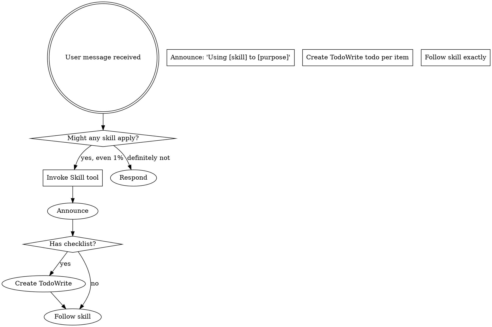

# 第9章研究报告：多平台适配

## 研究概览

| 属性 | 值 |
|------|-----|
| 章节 | ch09: 多平台适配 |
| 源码文件 | using-superpowers/SKILL.md, references/copilot-tools.md, references/codex-tools.md |
| 研究深度 | 完整阅读主要文件 |
| 关键发现 | 10 个核心发现 |

## 源码文件分析

### 1. using-superpowers/SKILL.md — 核心技能文档

**文件路径**: `/Users/yaya/.openclaw/workspace/superpowers/skills/using-superpowers/SKILL.md`

**核心规则**：

> "If you think there is even a 1% chance a skill might apply to what you are doing, you ABSOLUTELY MUST invoke the skill."

**绝对重要**：

```markdown
<EXTREMELY-IMPORTANT>
If a skill applies to your task, you do not have a choice. You must use it.

This is not negotiable. This is not optional. You cannot rationalize your way out of this.
</EXTREMELY-IMPORTANT>
```

### 规则优先级

```
1. 用户的明确指令（CLAUDE.md, GEMINI.md, AGENTS.md, 直接请求）— 最高优先级
2. Superpowers skills — 在与默认系统行为冲突时覆盖默认行为
3. 默认系统提示 — 最低优先级
```

### 工具映射

**Claude Code**: 使用 `Skill` 工具
**Copilot CLI**: 使用 `skill` 工具
**Gemini CLI**: 使用 `activate_skill` 工具

### 技能使用流程



### RED FLAGS（理性化警示）

| 想法 | 真相 |
|------|------|
| "这只是简单的问题" | 问题即任务。检查技能。 |
| "我需要先获取更多上下文" | 技能检查在澄清问题之前。 |
| "让我先探索代码库" | 技能告诉你如何探索。先检查。 |
| "这不需要正式技能" | 如果存在技能，就使用它。 |
| "我会先做这一件事" | 做任何事之前先检查。 |
| "我记得这个技能" | 技能会演进。读取当前版本。 |

### 技能优先级

当多个技能可能适用时，使用此顺序：

1. **流程技能优先**（brainstorming, debugging）— 这些决定如何处理任务
2. **实现技能其次**（frontend-design, mcp-builder）— 这些指导执行

### 技能类型

| 类型 | 说明 |
|------|------|
| **Rigid**（严格） | 精确遵循。不适应掉纪律。 |
| **Flexible**（灵活） | 根据上下文调整原则。 |

### 2. Copilot CLI 工具映射

**文件路径**: `references/copilot-tools.md`

| Claude Code | Copilot CLI |
|-------------|-------------|
| `Read` | `view` |
| `Write` | `create` |
| `Edit` | `edit` |
| `Bash` | `bash` |
| `Grep` | `grep` |
| `Glob` | `glob` |
| `Skill` tool | `skill` |
| `Task` tool | `task` |
| `TodoWrite` | `sql` with built-in `todos` table |

## 关键发现

### 发现 1: 1% 规则

只要有 1% 的可能性技能适用，就必须调用技能来检查。这不是可选项。

### 发现 2: 用户指令优先

用户的明确指令（CLAUDE.md 等）永远优先于技能。

### 发现 3: 工具映射确保跨平台

每个平台都有等效的工具，只是名称不同。

### 发现 4: 流程技能优先于实现技能

当多个技能可能适用时，先处理流程（如 brainstorming），再处理实现。

### 发现 5: 技能有 Rigid 和 Flexible 两种类型

Rigid 技能必须精确遵循，Flexible 技能可以根据上下文调整。

### 发现 6: RED FLAGS 帮助识别理性化

列出的理性化想法帮助识别何时在逃避技能。

### 发现 7: 技能检查在所有响应之前

在响应用户之前（即使是澄清问题）也必须检查技能。

### 发现 8: 公告增加透明度

使用技能时公告："I'm using [skill] to [purpose]"。

### 发现 9: TodoWrite 用于检查清单

如果技能有检查清单，为每个项目创建 TodoWrite。

### 发现 10: 探索代码库之前检查技能

在探索代码库之前也要检查技能，因为技能告诉你如何探索。

## 写作要点

1. **1% 规则强调**: 这是核心规则，不是可选项
2. **工具映射表格**: 展示 Claude Code vs Copilot CLI 工具对比
3. **RED FLAGS 警示**: 帮助识别理性化
4. **技能使用流程图**: 用 Mermaid 展示
5. **平台差异说明**: 解释不同平台的不同

## 预判的读者困惑

1. "什么情况下可以跳过技能？" - 需要解释用户指令优先
2. "Rigid 和 Flexible 技能有什么区别？" - 需要给出判断标准
3. "Copilot CLI 和 Claude Code 有什么不同？" - 需要对比说明

## 跨章节引用

- 第1章 介绍 Superpowers 如何工作
- 第4章 Brainstorming 是流程技能示例
- 第8章 TDD 是 Rigid 技能示例

<!-- RESEARCH_COMPLETE -->
