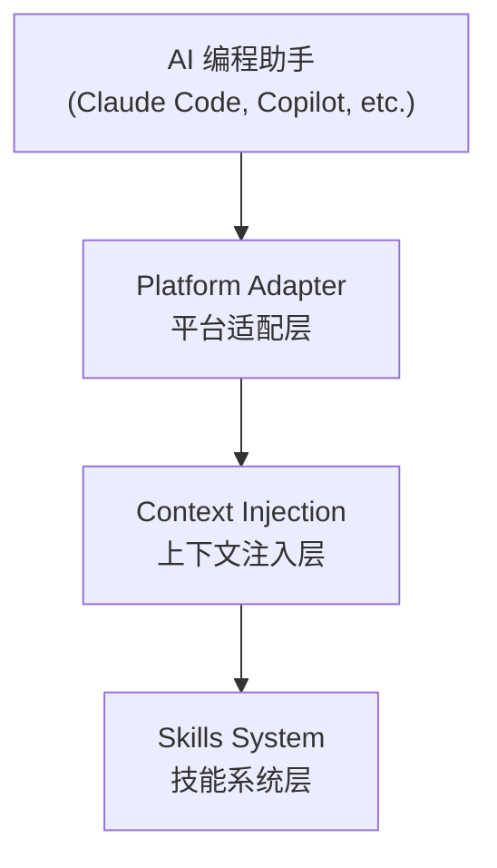
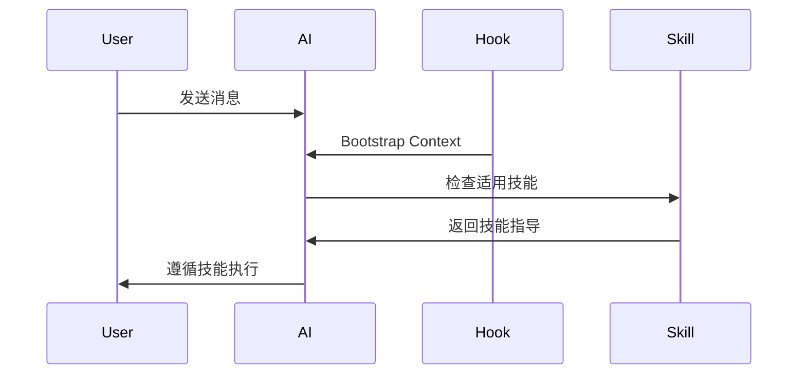
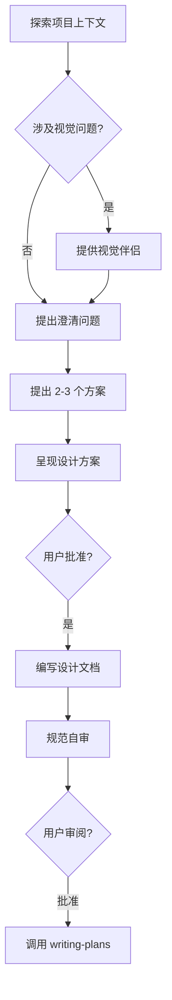
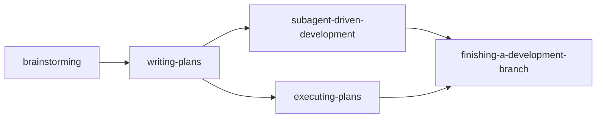
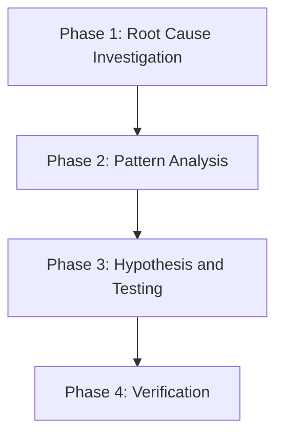
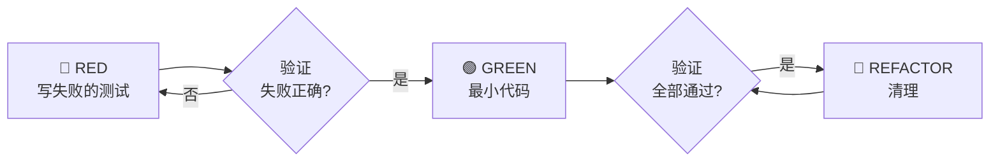
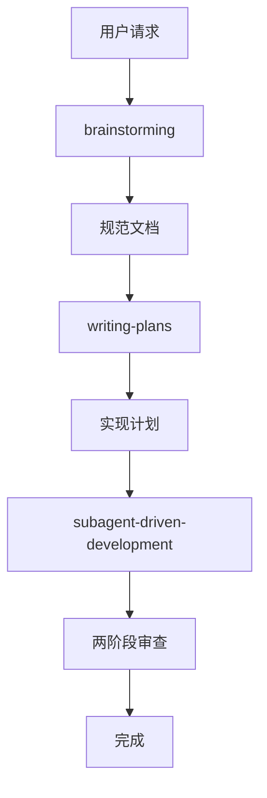

# Superpowers 源码解析：从 AI 编程助手到超级开发者

> 你有没有过这样的经历：让 AI 帮你写代码，它哗哗地输出一大堆，看起来很专业，但一跑起来——编译错误、逻辑错误、边界情况全没考虑。你花了半小时改 AI 写的代码，比自己写还累。
>
> 或者另一个场景：你让 AI 帮你开发一个功能，它上来就开始写代码，写了三百行之后你发现——它理解错了需求。你不得不从头来。
>
> Superpowers 就是来解决这些问题的。它不是让 AI 更快地写代码，而是让 AI 学会"先想清楚再动手"。

---

## 目录

1. [第1章：Superpowers 概述与快速上手](#第1章superpowers-概述与快速上手)
2. [第2章：系统架构设计](#第2章系统架构设计)
3. [第3章：Skills 系统实现](#第3章skills-系统实现)
4. [第4章：Brainstorming 技能](#第4章brainstorming-技能)
5. [第5章：Subagent-Driven Development](#第5章subagent-driven-development)
6. [第6章：其他核心技能](#第6章其他核心技能)
7. [第7章：Systematic Debugging](#第7章systematic-debugging)
8. [第8章：Test-Driven Development](#第8章test-driven-development)
9. [第9章：多平台适配](#第9章多平台适配)
10. [第10章：高级主题与生态](#第10章高级主题与生态)
11. [附录：快速参考](#附录快速参考)

---

# 第1章：Superpowers 概述与快速上手

## 1.1 Superpowers 是什么

**Superpowers** 是一个为 AI 编程助手提供"超能力"的插件框架。安装之后，你的 AI 助手会从"只会写代码"进化为"能够进行系统化设计、规范开发、持续迭代"的超级开发者。

### 核心设计理念

想象一下 RPG 游戏中的装备系统：穿上不同的装备，你的角色就获得了不同的能力。Superpowers 就是这样一个"装备系统"——每个 **Skill（技能）** 是一种可以独立使用、也可以组合的功能块。

当你需要设计一个功能时，"brainstorming" 技能自动激活，帮助你明确需求；当你需要实现时，"TDD" 技能自动激活，确保你先写测试再写代码；当你遇到 bug 时，"systematic-debugging" 技能自动激活，引导你系统化地定位问题。

### 与其他工具的区别

大多数 AI 编程助手追求的是"秒级生成代码"——你给一个提示，它给你一堆代码。这种方式的代价是：代码质量参差不齐，边界情况被忽略，架构设计全靠运气。

Superpowers 的追求是"一次做对"——通过结构化的工作流程，确保 AI 在动手之前先理解需求，先做设计，先写测试。

## 1.2 工作原理概览

Superpowers 的核心是 **Skills 系统**和 **Hooks 机制**。

### Skills 系统

**Skill** 是一种特殊的 Markdown 文件，定义了某种工作方式的最佳实践。每个 Skill 包含：
- 触发条件（什么时候应该用这个技能）
- 工作流程（如何执行这个技能）
- 质量标准（什么算做好了）

Skills 会自动触发——不需要你手动调用。

### Hooks 机制

**Hook** 是在特定事件发生时自动执行的脚本。Superpowers 在会话启动时注入上下文。

## 1.3 快速安装

### Claude Code

```bash
/claude plugin install superpowers@claude-plugins-official
```

### Copilot CLI

```bash
copilot plugin install superpowers
```

安装完成后，重新启动 AI 编程助手，Superpowers 会自动激活。

## 1.4 第一个项目

让我们通过一个简单项目来体验 Superpowers：

**需求**：创建一个待办事项列表应用。

**第一步：告诉 AI 你的需求**

```
我想创建一个待办事项列表应用，使用 React。
```

**第二步：Superpowers 自动激活 brainstorming**

AI 会先进行需求澄清，而不是直接写代码：

```
在开始设计之前，我需要澄清几个问题：
1. 待办事项需要持久化存储吗？
2. 需要支持分类或标签吗？
3. 有移动端适配需求吗？
```

**第三步：设计文档**

在获得你的回答后，AI 会编写设计文档，包括：
- 技术选型
- 组件结构
- 数据流设计

**第四步：实现计划**

设计批准后，AI 会创建实现计划，每个步骤都有清晰的检查点。

**第五步：TDD 实现**

按照红-绿-重构循环，先写测试，再写代码。

## 1.5 核心概念

| 概念 | 说明 |
|------|------|
| **Skill** | 定义工作方式的 Markdown 文件 |
| **Hook** | 事件触发的脚本 |
| **HARD-GATE** | 没有批准就不能前进的硬性规则 |
| **RED FLAGS** | 识别理性化的信号 |
| **Bootstrap** | 会话初始化时的上下文注入 |

## 本章小结

本章介绍了 Superpowers 的基本概念：

- Superpowers 是一个 AI 编程助手的"超能力"框架
- Skills 系统提供结构化的工作流程
- Hooks 机制在会话启动时注入上下文
- 安装简单，支持多种 AI 编程平台
- 通过 brainstorm → design → plan → implement → test 的流程，确保一次做对

---

# 第2章：系统架构设计

## 2.1 整体架构

Superpowers 采用三层架构设计：



| 层级 | 职责 |
|------|------|
| **Platform Adapter** | 处理不同 AI 平台的差异 |
| **Context Injection** | 在会话启动时注入上下文 |
| **Skills System** | 提供可组合的工作技能 |

## 2.2 平台适配层

不同 AI 编程助手有不同的工具接口。Platform Adapter 层统一这些差异。

### 支持的平台

| 平台 | 工具映射 |
|------|----------|
| Claude Code | `Read`, `Write`, `Edit`, `Bash`, `Skill` |
| Copilot CLI | `view`, `create`, `edit`, `bash`, `skill` |
| Gemini CLI | `activate_skill`, 原生工具 |

## 2.3 上下文注入层

Context Injection 在会话启动时注入 Bootstrap Context，包含：
- 可用的技能列表
- 触发条件映射
- 默认行为规则

### Bootstrap Context

Bootstrap Context 是一段特殊的上下文，告诉 AI：
- 它有了"超能力"
- 什么时候应该使用哪个技能
- 如何调用技能

## 2.4 技能系统层

Skills System 是 Superpowers 的核心。它包含：
- Skill 定义文件（SKILL.md）
- 辅助脚本
- 测试场景

### 目录结构

```
skills/
├── brainstorming/
│   ├── SKILL.md
│   ├── spec-document-reviewer-prompt.md
│   └── visual-companion.md
├── subagent-driven-development/
│   ├── SKILL.md
│   ├── implementer-prompt.md
│   └── spec-reviewer-prompt.md
└── ...
```

## 2.5 数据流



## 本章小结

本章讲解了 Superpowers 的三层架构：
- Platform Adapter 统一不同平台的差异
- Context Injection 在会话启动时注入上下文
- Skills System 提供可组合的工作技能

这种架构确保 Superpowers 可以适配多种 AI 编程平台，同时保持核心功能的一致性。

---

# 第3章：Skills 系统实现

## 3.1 Skill 是什么

**Skill** 是一种 Markdown 格式的过程文档，定义了某种工作方式的最佳实践。

### 三个属性

| 属性 | 说明 |
|------|------|
| **Reusable** | 可跨项目重用 |
| **Triggerable** | 可以自动触发 |
| **Composable** | 可以组合使用 |

### 与 Prompt 的区别

| 方面 | Prompt | Skill |
|------|--------|-------|
| 触发方式 | 每次手动输入 | 自动检测触发 |
| 粒度 | 整个对话 | 具体任务 |
| 更新方式 | 每次对话不同 | 统一版本管理 |
| 上下文 | 需要复制粘贴 | 自动加载 |

## 3.2 Skill 文件结构

### 基本结构

```markdown
---
name: skill-name
description: 当...时使用此技能
---

# Skill Title

## Overview

简要说明。

## When to Use

何时使用。

## The Process

执行步骤。
```

### frontmatter 规范

```yaml
---
name: brainstorming
description: Use when starting a new feature or significant change
---
```

| 字段 | 必需 | 说明 |
|------|------|------|
| `name` | 是 | 技能名称 |
| `description` | 是 | 简短描述 |

## 3.3 触发条件

### 自动触发

当 AI 检测到某个 Skill 的触发条件时，自动加载该 Skill。

### 手动触发

使用 Skill 工具：

```bash
/Skill skill-name
```

## 3.4 Skill 类型

| 类型 | 说明 | 示例 |
|------|------|------|
| **Process** | 定义工作流程 | brainstorming, TDD |
| **Implementation** | 实现指导 | frontend-design |
| **Reference** | 参考文档 | API docs |

## 3.5 编写高质量 Skill

### 好 Skill 的标准

- ✅ 触发条件清晰
- ✅ 步骤具体可执行
- ✅ 有明确的产出
- ✅ 包含质量标准

### 避免的问题

- ❌ 触发条件模糊
- ❌ 步骤过于抽象
- ❌ 缺少实际示例
- ❌ 过于冗长

## 本章小结

本章深入讲解了 Skills 系统：
- Skill 是可重用、可触发、可组合的过程文档
- 由 frontmatter、Overview、When to Use、The Process 组成
- 有 Process、Implementation、Reference 三种类型
- 遵循好 Skill 的标准，避免常见问题

---

# 第4章：Brainstorming 技能

## 4.1 HARD-GATE：核心规则

Brainstorming 技能的核心是 **HARD-GATE** 规则：

```
<HARD-GATE>
Do NOT invoke any implementation skill, write any code, scaffold any project, or take any implementation action until you have presented a design and the user has approved it.
</HARD-GATE>
```

**翻译**：在用户批准设计之前，AI 不能写任何代码。没有任何例外。

### 反模式：太简单不需要设计

> "这只是一个 todo 列表而已，不需要设计吧？"

**不，每个项目都经过此过程。**

## 4.2 9 步检查清单

| 步骤 | 内容 |
|------|------|
| 1 | 探索项目上下文 |
| 2 | 提供视觉伴侣（可选）|
| 3 | 提出澄清问题 |
| 4 | 提出 2-3 个方案 |
| 5 | 呈现设计方案 |
| 6 | 编写设计文档 |
| 7 | 规范自审 |
| 8 | 用户审阅书面规范 |
| 9 | 过渡到实现 |



## 4.3 理解需求

### YAGNI 原则

**YAGNI = You Aren't Gonna Need It（你不会需要它）**

从所有设计中删除不必要的功能。

## 4.4 设计文档

### 保存位置

`docs/superpowers/specs/YYYY-MM-DD-<topic>-design.md`

## 本章小结

- HARD-GATE 是核心规则：没有设计批准就没有代码
- 9 步检查清单确保每个项目都经过完整的设计流程
- YAGNI 原则删除不必要的功能
- 规范自审确保文档质量

---

# 第5章：Subagent-Driven Development

## 5.1 核心原则

> "Fresh subagent per task + two-stage review (spec then quality) = high quality, fast iteration"

### 为什么使用子代理？

**隔离上下文是关键。** 每个子代理不继承主会话的上下文，保持专注。

## 5.2 两阶段审查

### 第一阶段：规范合规审查

**关键原则**：**不相信报告**

必须独立验证代码，而不是相信实现者的报告。

### 第二阶段：代码质量审查

仅在规范合规审查通过**之后**进行。

## 5.3 模型选择策略

| 任务类型 | 模型 | 信号 |
|----------|------|------|
| 机械实现 | 快速、便宜的模型 | 1-2 个文件，清晰规范 |
| 集成和判断 | 标准模型 | 多文件协调 |
| 架构和设计 | 最强模型 | 需要设计判断 |

## 5.4 RED FLAGS（禁止事项）

```markdown
**Never:**
- Start implementation on main/master branch without explicit user consent
- Skip reviews (spec compliance OR code quality)
- Dispatch multiple implementation subagents in parallel (conflicts)
- Start code quality review before spec compliance is ✅
```

## 本章小结

- 隔离上下文是子代理的核心优势
- 两阶段审查（规范合规 → 代码质量）确保质量和效率
- 模型选择策略优化成本
- RED FLAGS 捕获常见错误

---

# 第6章：其他核心技能

## 6.1 技能协作概览



## 6.2 writing-plans — 实现计划编写

### 计划结构

```markdown
# [Feature] Implementation Plan

**Goal:** [一句话]

---

### Task N: [组件名]

- [ ] Step 1: Write failing test
- [ ] Step 2: Run test (verify fails)
- [ ] Step 3: Write minimal code
- [ ] Step 4: Run test (verify passes)
- [ ] Step 5: Commit
```

## 6.3 receiving-code-review — 接收代码审查

### 响应模式

```
1. READ: Complete feedback without reacting
2. UNDERSTAND: Restate in own words
3. VERIFY: Check against codebase reality
4. EVALUATE: Technically sound?
5. RESPOND: Technical acknowledgment or pushback
6. IMPLEMENT: One at a time, test each
```

### 禁止的响应

- ❌ "You're absolutely right!"
- ❌ "Great point!"
- ❌ "Let me implement that now"

## 6.4 finishing-a-development-branch — 完成开发分支

### 4 个选项

1. 本地合并
2. 创建 Pull Request
3. 保留分支
4. 丢弃工作

## 本章小结

- writing-plans 假设执行者没有上下文，输出完整的实现计划
- receiving-code-review 强调技术评估而非情感表演
- finishing-a-development-branch 提供结构化的 4 选项完成流程

---

# 第7章：Systematic Debugging

## 7.1 铁律

```
NO FIXES WITHOUT ROOT CAUSE INVESTIGATION FIRST
```

**翻译**：没有根本原因调查，就不能修复。

### 反模式：快速修复

> "这只是一个简单的问题，我直接改一下就好了。"

**不。即使问题看起来简单，也不要跳过调试过程。**

## 7.2 四阶段流程

| 阶段 | 内容 |
|------|------|
| 1 | 根本原因调查 |
| 2 | 模式分析 |
| 3 | 假设与测试 |
| 4 | 验证 |



## 7.3 Phase 1: 根本原因调查

### 仔细阅读错误信息

- 不要跳过错误或警告
- 完全阅读堆栈跟踪
- 记录行号、文件路径

### 一致地复现

- 你能可靠地触发它吗？
- 如果不可复现 → 收集更多数据，**不要猜测**

## 7.4 Phase 2: 模式分析

- 找到工作的例子
- 与参考比较
- 识别差异
- 理解依赖

## 本章小结

- 铁律是核心：没有调查就不能修复
- 四阶段流程确保系统化调查
- 不要猜测是基本原则
- 源头修复而不是症状修复

---

# 第8章：Test-Driven Development

## 8.1 铁律

```
NO PRODUCTION CODE WITHOUT A FAILING TEST FIRST
```

**翻译**：没有失败的测试，就不能写生产代码。

### 核心原则

> "If you didn't watch the test fail, you don't know if it tests the right thing."

## 8.2 红-绿-重构循环



## 8.3 常见借口及真相

| 借口 | 真相 |
|------|------|
| "太简单不需要测试" | 简单代码也会坏 |
| "我之后再测试" | 测试立即通过证明不了什么 |
| "手动测试就够了" | 手动 ≠ 系统 |

## 8.4 RED FLAGS — 停止并重新开始

- ❌ 代码在测试之前
- ❌ 测试立即通过
- ❌ "就这一次"
- ❌ "我已经手动测试了"

**所有这些意味着：删除代码。从 TDD 重新开始。**

## 本章小结

- 铁律是核心：没有失败测试就不能写代码
- 红-绿-重构循环确保测试优先
- 常见借口被明确反驳
- RED FLAGS 帮助识别何时需要重新开始

---

# 第9章：多平台适配

## 9.1 核心原则：1% 规则

> "If you think there is even a 1% chance a skill might apply to what you are doing, you ABSOLUTELY MUST invoke the skill."

**翻译**：只要有 1% 的可能性技能适用，就必须调用技能来检查。

### RED FLAGS（理性化警示）

| 想法 | 真相 |
|------|------|
| "这只是简单的问题" | 问题即任务。检查技能。 |
| "我记得这个技能" | 技能会演进。读取当前版本。 |

## 9.2 指令优先级

| 优先级 | 指令类型 |
|--------|----------|
| 1 | 用户的明确指令（最高）|
| 2 | Superpowers 技能 |
| 3 | 默认系统提示（最低）|

## 9.3 工具映射

| Claude Code | Copilot CLI | 用途 |
|-------------|-------------|------|
| `Read` | `view` | 读取文件 |
| `Write` | `create` | 创建文件 |
| `Skill` | `skill` | 调用技能 |
| `Task` | `task` | 分派子代理 |

## 9.4 技能优先级

| 优先级 | 技能类型 |
|--------|----------|
| 1 | 流程技能（brainstorming、debugging）|
| 2 | 实现技能（frontend-design、mcp-builder）|

## 本章小结

- 1% 规则是核心：只要可能就要检查
- 工具映射确保跨平台一致
- 用户指令优先于技能
- 流程技能优先于实现技能

---

# 第10章：高级主题与生态

## 10.1 核心原则：技能编写就是 TDD

> "Writing skills IS Test-Driven Development applied to process documentation."

### TDD 类比

| TDD 概念 | 技能创建 |
|----------|----------|
| 测试用例 | 压力场景 |
| 生产代码 | SKILL.md |
| 测试失败 | 没有技能时违反规则 |
| 重构 | 堵住漏洞 |

## 10.2 什么时候创建技能

### 创建当

- ✅ 技术不是直觉上显而易见的
- ✅ 会在项目中再次参考
- ✅ 模式广泛适用

### 不要创建

- ❌ 一次性解决方案
- ❌ 标准实践（已有文档）
- ❌ 特定项目的约定

## 10.3 技能类型

| 类型 | 说明 | 示例 |
|------|------|------|
| **Technique** | 有步骤的具体方法 | condition-based-waiting |
| **Pattern** | 思考问题的方式 | flatten-with-flags |
| **Reference** | API 文档 | office docs |

## 10.4 测试技能

### RED 阶段：基线测试

在没有技能的情况下运行测试，观察代理失败，记录确切的失败。

### GREEN 阶段：编写技能

针对具体的基线失败编写技能。

### REFACTOR 阶段：堵洞

发现新的理性化，添加对策。

## 本章小结

- 技能编写就是 TDD 应用于过程文档
- 红-绿-重构循环：基线测试 → 编写技能 → 堵洞
- 压力场景测试捕获代理的实际理性化借口
- 技能类型：Technique、Pattern、Reference

---

# 附录：快速参考

## A.1 核心规则速查

| 技能 | 铁律 |
|------|------|
| **Brainstorming** | 没有设计批准就不能实现 |
| **Systematic Debugging** | 没有根因调查就不能修复 |
| **TDD** | 没有失败的测试就不能写代码 |
| **Subagent-Driven Development** | 没有两阶段审查就不能交付 |

## A.2 技能速查表

### Brainstorming

**9 步检查清单**：探索 → 澄清 → 方案 → 设计 → 文档 → 自审 → 审阅 → 计划

### TDD

**红-绿-重构**：🔴 RED → ✅ GREEN → 🔵 REFACTOR

### Subagent-Driven Development

**两阶段审查**：规范合规审查 → 代码质量审查

## A.3 RED FLAGS（通用）

- "这只是简单的问题"
- "我需要先获取更多上下文"
- "让我先探索代码库"
- "这不需要正式技能"
- "我已经手动测试了"
- "就这一次"

## A.4 原则速查

| 缩写 | 全称 | 说明 |
|------|------|------|
| YAGNI | You Aren't Gonna Need It | 不要添加不需要的功能 |
| DRY | Don't Repeat Yourself | 不要重复知识 |
| HARD-GATE | - | 没有批准就不能前进 |
| RED FLAGS | - | 识别理性化的信号 |

## A.5 文件命名规范

| 文件类型 | 命名规范 | 示例 |
|----------|----------|------|
| 规范 | `YYYY-MM-DD-<topic>-design.md` | `2026-04-06-login-design.md` |
| 计划 | `YYYY-MM-DD-<feature-name>.md` | `2026-04-06-user-auth.md` |

## A.6 工作流概览



---

**祝你在 Superpowers 的使用中取得成功！**
